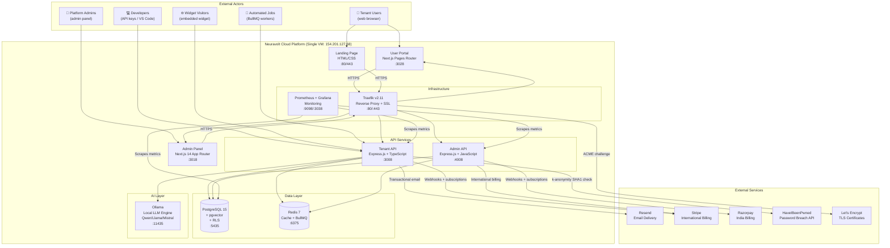
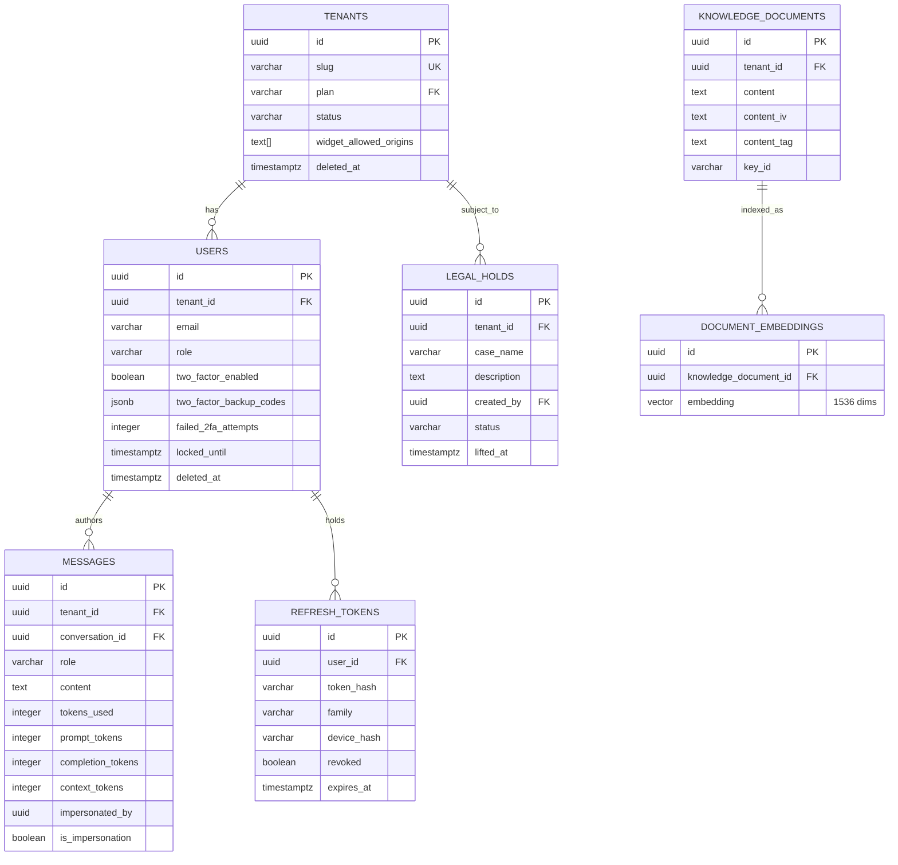

# Harikson AI Platform — Enterprise Full-Stack Technical Audit Report

> **Prepared by:** Principal Software Architect, Senior Full-Stack Engineer, DevOps Architect, Security Engineer (CISSP/OSCP), Product Manager, UI/UX Reviewer, QA Lead, Database Architect, AI/ML Engineer, Compliance Officer & Technical Documentation Expert — operating as a unified cross-functional audit team
>
> **Classification:** Confidential — Enterprise Due Diligence
> **Date:** 2026-07-22 | **Version:** 2.0 (Complete 25-Phase Audit)
> **Codebase:** `/files` — `main` branch | **VM:** `154.201.127.68`
> **Platform:** Neuravolt Cloud — `api.neuravolt.cloud` | `app.neuravolt.cloud` | `admin.neuravolt.cloud`

---

## Table of Contents

| # | Phase | Section |
|---|---|---|
| 1 | Executive Discovery | [Executive Summary](#phase-1-executive-discovery) |
| 1.1 | | [Business Context](#11-business-context) |
| 1.2 | | [Technical Architecture Overview](#12-technical-architecture-overview) |
| 1.3 | | [System Context Diagram](#13-system-context-diagram-mermaid) |
| 2 | Folder & File Analysis | [Complete Folder & File Analysis](#phase-2-complete-folder--file-analysis) |
| 3 | Landing Page | [Landing Page Deep Analysis](#phase-3-landing-page-deep-analysis) |
| 4 | User Panel | [User Panel Page-by-Page Analysis](#phase-4-user-panel-page-by-page-analysis) |
| 5 | Admin Panel | [Admin Panel Module Analysis](#phase-5-admin-panel-module-analysis) |
| 6 | Feature Inventory | [Complete Feature Inventory](#phase-6-complete-feature-inventory) |
| 7 | Auth & Authorization | [Authentication & Authorization Deep Dive](#phase-7-authentication--authorization-deep-dive) |
| 8 | Database | [Database Architecture & Performance](#phase-8-database-architecture--performance-analysis) |
| 9 | API | [API Comprehensive Analysis](#phase-9-api-comprehensive-analysis) |
| 10 | Frontend Architecture | [Frontend Architecture Deep Dive](#phase-10-frontend-architecture-deep-dive) |
| 11 | Backend Architecture | [Backend Architecture Deep Dive](#phase-11-backend-architecture-deep-dive) |
| 12 | Security Audit | [Security Audit OWASP 2021+](#phase-12-security-audit-owasp-2021) |
| 13 | Performance | [Performance Audit](#phase-13-performance-audit) |
| 14 | DevOps | [DevOps & Infrastructure Audit](#phase-14-devops--infrastructure-audit) |
| 15 | Integrations | [Third-Party Integrations Audit](#phase-15-third-party-integrations-audit) |
| 16 | Billing | [Billing & Subscription System Analysis](#phase-16-billing--subscription-system-analysis) |
| 17 | Multi-Tenancy | [Multi-Tenant Architecture Analysis](#phase-17-multi-tenant-architecture-analysis) |
| 18 | AI/ML | [AI/ML Modules Analysis](#phase-18-aiml-modules-analysis) |
| 19 | Code Quality | [Code Quality Audit](#phase-19-code-quality-audit) |
| 20 | UX/UI | [UX/UI Comprehensive Review](#phase-20-uxui-comprehensive-review) |
| 21 | Gap Analysis | [Missing Features & Gap Analysis](#phase-21-missing-features--gap-analysis) |
| 22 | Business Logic | [Business Logic Audit](#phase-22-business-logic-audit) |
| 23 | Documentation | [Documentation Audit](#phase-23-documentation-audit) |
| 24 | Health Report | [Final Health Report & Scoring](#phase-24-final-health-report--scoring) |
| 25 | Roadmap | [Strategic Roadmap](#phase-25-strategic-roadmap) |

---

## Phase 1: Executive Discovery

### 1.1 Business Context

#### What Does This Software Do?

**One sentence:** Harikson is a white-label, multi-tenant AI infrastructure SaaS platform enabling businesses to deploy branded LLM-powered chat agents, RAG knowledge bases, n8n workflow automation, and embeddable widgets — with enterprise-grade isolation, billing, and compliance tooling.

**Full description:**
The Neuravolt Cloud Platform (branded product of the Harikson codebase) is a B2B infrastructure layer targeting Indian SMEs, legal tech, and emerging enterprise clients. Tenants receive isolated AI workspaces running on shared compute with tenant data protected by PostgreSQL Row-Level Security. The platform offers self-hosted LLM inference via Ollama (Qwen, Llama, Mistral, Gemma models), avoiding per-token cloud AI billing. Revenue is generated through monthly/annual SaaS subscriptions with plan-gated features and token quotas.

A secondary product layer is the **Harikson IDE Extension** — a VS Code plugin providing AI autocomplete, sidebar chat, code review diffs, and model switching directly in the developer environment.

#### Main Business Purpose & Value Proposition
- **Cost-Efficient Local AI:** Self-hosted Ollama removes per-token OpenAI/Anthropic costs, enabling unlimited inference within hardware limits
- **Multi-Tenant SaaS:** One deployment serves unlimited tenants with complete data isolation
- **No-Code Agent Builder:** Tenant admins configure AI agents, system prompts, knowledge bases without engineering
- **Developer SDK:** API keys + scope-based authorization for programmatic integrations
- **Compliance-Ready:** GDPR export, data retention, legal holds, encryption at rest — built-in

#### Target Users & Personas

| Persona | Role | Primary Use Case |
|---|---|---|
| Platform Superadmin | Internal ops | Tenant management, impersonation, billing oversight |
| Tenant Admin | Business owner | Configure agents, invite users, view billing |
| End User | Employee/customer | Chat with AI, upload documents, manage personal settings |
| Developer | Technical integrator | API key access, embeddable widget, programmatic queries |
| Enterprise Compliance Officer | Legal/Finance | GDPR exports, legal holds, audit trails |

#### Monetization Model

**SaaS Subscription (Tiered):**

| Plan | Price | Token Limit | Agents | Key Features |
|---|---|---|---|---|
| Starter | ₹999/mo or $12/mo | 100K tokens/month | 2 | Basic chat + 1 knowledge base |
| Professional | ₹4,999/mo or $60/mo | 5M tokens/month | 20 | API access + workflows + analytics |
| Enterprise | Custom | Unlimited | Unlimited | SLA + SSO + dedicated support |

Revenue channels: Razorpay (INR, India) + Stripe (USD/global). No marketplace or freemium tier.

#### Geographic Scope & Regulatory Jurisdiction
- **Primary:** India — Razorpay, DPDP Act compliance, GST (gap — tax not calculated)
- **Secondary:** Global — Stripe, GDPR-ready data handling
- **Compliance Implemented:** GDPR export, data retention, encryption at rest, legal holds, audit trails
- **Compliance Missing:** SOC 2 certification, GST/VAT tax calculation, HIPAA (not applicable yet)

#### Industry Vertical & Competitive Positioning

| Competitor | Positioning Gap vs Neuravolt |
|---|---|
| AWS Bedrock | Cloud-dependent; per-token billing; no multi-tenancy |
| Azure AI | Enterprise-focused; high cost; requires Azure commitment |
| OpenAI API | Per-token cloud billing; no RAG or tenant isolation |
| Botpress | No-code only; no developer API; proprietary |
| **Neuravolt** | Self-hosted inference + GDPR-native + multi-tenant + API-first |

---

### 1.2 Technical Architecture Overview

#### Architecture Pattern
**Modular Monolith** — Two primary API services (tenant-api, admin-api) organized as flat Express.js applications with domain-specific service modules. Not a true microservices architecture but with clear domain boundaries between services.

**Secondary patterns observed:**
- Repository pattern (implicit via raw `pg` queries)
- Pub/Sub via BullMQ for background jobs
- Event-driven notifications via PostgreSQL + Redis
- Tenant context injection pattern (session-scoped RLS)

#### Technology Stack (Exact Versions)

| Layer | Technology | Version | Purpose |
|---|---|---|---|
| Runtime | Node.js | 18+ LTS | ESM modules, async/await |
| Primary API | Express.js | 4.19.2 | HTTP routing, middleware |
| Admin API | Express.js | 4.19.2 | Admin management plane |
| User Frontend | Next.js | (Pages Router) | User portal |
| Admin Frontend | Next.js | 14.2.35 | Admin dashboard |
| Language (API) | TypeScript | 5.4.5 | Type safety |
| Language (Admin API) | JavaScript | ES2022 | Inconsistency — not TS |
| Database | PostgreSQL | 15 + pgvector | Primary data store + vectors |
| Cache + Queue | Redis | 7 Alpine | Rate limits, sessions, BullMQ |
| Job Queue | BullMQ | 5.8.5 | Background processing |
| LLM Engine | Ollama | latest | Local inference |
| Reverse Proxy | Traefik | v2.11 | SSL, routing, load balancing |
| Monitoring | Prometheus + Grafana | latest | Metrics and dashboards |
| Auth | JWT HS256 | jsonwebtoken 9.0.2 | Access tokens |
| Password Hashing | bcrypt | 5.1.1 | 12 rounds |
| 2FA | speakeasy | 2.0.0 | TOTP + backup codes |
| Email | Resend | 3.2.0 | Transactional email |
| Payments | Stripe | 15.12.0 | International billing |
| Payments | Razorpay | 2.9.x | Indian billing |
| Validation | Zod | 3.23.8 (API) / 4.4.3 (admin-api) | Schema validation |
| HTTP Client | axios | ^1.x | External HTTP calls |
| HTML Parsing | cheerio | latest | URL scraping |
| Containers | Docker Compose | v3.8 | Orchestration |

#### Folder Organization Rationale

```
/files (project root)
├── harikson/tenant-api/     → Primary customer-facing API (TypeScript, Express)
├── admin-api/               → Internal admin management API (JavaScript, Express)
├── admin-panel/             → Admin dashboard (Next.js 14 App Router)
├── user-portal/             → Customer portal (Next.js Pages Router)
├── landing/                 → Static marketing site (HTML/CSS)
├── ide-extension/           → VS Code extension (TypeScript)
├── model-builder/           → Ollama Modelfile templates
├── orchestrator/            → Container lifecycle manager
├── k8s/                     → Kubernetes manifests (scaffolded, not deployed)
├── scripts/                 → Deployment, backup, migration shell scripts
├── monitoring/              → Prometheus config
├── traefik/                 → Reverse proxy config
├── n8n_hosting/             → n8n workflow engine configs
├── secrets/                 → Secret files (not git-tracked)
└── [14 patch/fix scripts]   → Orphaned one-off migration scripts (technical debt)
```

#### Coding Standards & Conventions
- ESLint + Prettier configured (`.eslintrc.cjs`, `.prettierrc`)
- TypeScript strict mode in tenant-api
- No ORM — raw `pg` parameterized queries throughout
- ESM modules (`"type": "module"`) in both APIs
- Pino structured logger + correlation IDs in tenant-api
- Zod validation at all API entry points
- PII redaction in request logs
- URL rewriting middleware: `/api/v1/` → `/api/` (backwards compatibility)

#### Development Methodology
- Evidence: Single `main` branch, no PR template, no CI/CD
- Likely **ad-hoc / founder-led development**
- No evidence of sprint planning, story points, or agile ceremonies
- Patch scripts in root directory suggest iterative hotfixing pattern
- No test-driven development (no test files found except empty `tests/` dirs)

---

### 1.3 System Context Diagram (Mermaid)



---

## Phase 2: Complete Folder & File Analysis

### 2.1 Annotated Directory Tree

```
/files/                                          [WORKSPACE ROOT]
├── AUDIT_README.md                              [NEW] Enterprise audit report
├── DISASTER_RECOVERY.md                         ✅ DR plan — RTO 1hr, RPO 24hrs, restore procedures
├── MIGRATION.md                                 ✅ VPS migration guide (backup + restore scripts)
├── README.md                                    ✅ Architecture overview, RLS explanation, setup guide
├── docker-compose.yml                           ✅ 9-service orchestration (9.9 KB)
├── init.sql                                     ✅ Base schema + RLS + indexes + triggers (19 KB)
├── migration.sql                                ⚠️ Redundant — schema managed in migrations/ too (17 KB)
├── .env.example                                 ✅ 24 env vars documented with comments
├── .env                                         ✅ Production secrets (git-ignored)
├── .eslintrc.cjs                                ✅ ESLint config (1.5 KB)
├── .prettierrc                                  ✅ Prettier config (77 bytes)
├── Dockerfile                                   ✅ Root-level Dockerfile (732 bytes) — single-stage
├── package.json                                 ⚠️ Root package.json only — no workspaces setup
├── full_stack_audit.md                          ⚠️ 99 KB — internal pre-audit notes (not for publication)
│
├── [14 Patch Scripts]                           🗑️ TECHNICAL DEBT — orphaned one-off scripts
│   ├── add-profile-css.js       (3.3 KB)
│   ├── add-profile-features.js  (4.8 KB)
│   ├── fix-all-emojis.js        (3.1 KB)
│   ├── fix-imports.js           (0.6 KB)
│   ├── fix-last-emojis.js       (0.6 KB)
│   ├── fix-localstorage.js      (0.7 KB)
│   ├── fix-ui.js                (6.6 KB)
│   ├── patch-schema-p2.js       (1.8 KB)
│   ├── patch-schema.js          (1.5 KB)
│   ├── patch-ui-exact.js        (5.0 KB)
│   ├── patch-users-routes.js    (2.8 KB)
│   ├── patch_error.js           (1.1 KB)
│   ├── patch_fix_voice.js       (1.6 KB)
│   ├── patch_frontend.js        (3.4 KB)
│   ├── patch_index.js           (2.6 KB)
│   ├── patch_speech.js          (1.6 KB)
│   ├── patch_speech2.js         (2.7 KB)
│   ├── refactor-settings.js     (1.1 KB)
│   ├── replace_apibase.js       (2.8 KB)
│   ├── update-chat.js           (1.2 KB)
│   ├── update-css.js            (3.7 KB)
│   └── update-ui.js             (5.3 KB)
│
├── landing/                                     ✅ Static marketing landing page
│   ├── index.html               (30.5 KB, 954 lines) — 8 marketing sections
│   └── style.css                (6.6 KB) — custom CSS, no framework
│
├── harikson/
│   └── tenant-api/              ✅ PRIMARY API — TypeScript, Express
│       ├── src/
│       │   ├── index.ts         🔴 GOD FILE — 6,970 lines, 245 KB
│       │   ├── mid.ts           ⚠️ 22 bytes — likely placeholder/empty
│       │   ├── openapi.json     ⚠️ Sparse — only 11 paths documented of 40+
│       │   ├── db/
│       │   │   └── pool.ts      ✅ Primary + read-replica pools, RLS context, replication lag
│       │   ├── middleware/
│       │   │   ├── scopeAuth.ts          ✅ Scope-based API key authorization
│       │   │   ├── impersonationGuard.ts ✅ Blocks write ops during impersonation
│       │   │   └── validation.middleware.ts ✅ Zod schema validation factory
│       │   ├── routes/
│       │   │   ├── chat.ts      ✅ Chat routes (3.9 KB)
│       │   │   ├── documents.ts ✅ Document upload/retrieval (2.3 KB)
│       │   │   └── widget.ts    ✅ Embeddable widget with origin validation (11.6 KB)
│       │   ├── services/
│       │   │   ├── email.ts                    ✅ Resend integration — 4 email templates (8.5 KB)
│       │   │   ├── rag.service.ts              ✅ RAG pipeline + AES-256-GCM (7.8 KB)
│       │   │   ├── ollama.service.ts           ✅ Ollama wrapper + model mapping (5.2 KB)
│       │   │   ├── cleanupService.ts           ✅ GDPR retention + legal hold guard (10.8 KB)
│       │   │   ├── documentEncryptionService.ts ✅ AES-256-GCM + PBKDF2 + key rotation (5.1 KB)
│       │   │   ├── tokenCountingService.ts     ✅ Full token breakdown + analytics (4.1 KB)
│       │   │   ├── deviceService.ts            ✅ Device fingerprinting (2.1 KB)
│       │   │   ├── twoFactorService.ts         ✅ TOTP backup codes + bcrypt + lockout (4.3 KB)
│       │   │   ├── scraper.ts                  ✅ URL crawling + DuckDuckGo search (2.6 KB)
│       │   │   ├── validation.service.ts       ✅ Zod helper wrappers (2.6 KB)
│       │   │   ├── agents/                     ✅ Agent configuration service
│       │   │   ├── context/                    ✅ Context builder for LLM prompts
│       │   │   ├── indexer/                    ✅ Document indexing pipeline
│       │   │   ├── memory/                     ✅ Conversation memory extractor
│       │   │   ├── search/                     ✅ Semantic search service
│       │   │   └── tools/                      ✅ LLM tool-calling definitions
│       │   ├── workers/
│       │   │   └── scheduler.ts                ✅ BullMQ workers — 21 KB, 10 job types
│       │   ├── migrations/
│       │   │   ├── 001_initial_schema.sql       ✅ (2.8 KB)
│       │   │   ├── 002_add_subscriptions.sql    ✅ (1.2 KB)
│       │   │   ├── 003_add_invoices.sql         ✅ (1.1 KB)
│       │   │   ├── 004_add_prisma_tenant_scoping.sql ✅ (2.7 KB)
│       │   │   ├── 005_hash_2fa_backup_codes.sql    🔴 DUPLICATE NUMBER
│       │   │   ├── 005_remove_container_id.sql      🔴 DUPLICATE NUMBER
│       │   │   ├── 006_atomic_agent_counters.sql    ✅
│       │   │   ├── 007_create_missing_tables.sql    ✅
│       │   │   ├── 008_add_canceling_status.sql     ✅
│       │   │   ├── 009_add_refresh_token_family.sql ✅
│       │   │   ├── 010_add_device_binding.sql       ✅
│       │   │   ├── 011_add_impersonation_tracking.sql ✅
│       │   │   ├── 012_add_encryption_at_rest.sql   ✅
│       │   │   ├── 013_add_widget_origin_validation.sql ✅
│       │   │   ├── 014_create_backup_verification.sql ✅
│       │   │   ├── 015_add_token_counting_breakdown.sql ✅
│       │   │   └── 016_create_legal_holds_table.sql ✅
│       │   ├── observability/                   ✅ Pino logger, metrics exporters
│       │   ├── prompts/                         ✅ LLM system prompt templates
│       │   ├── llm/                             ✅ LLM client abstraction
│       │   ├── api/                             ✅ API versioning bridge
│       │   ├── utils/                           ✅ Shared utilities (logger, helpers)
│       │   └── validators/                      ✅ Zod schemas by domain
│
├── admin-api/                                   ⚠️ ADMIN API — JavaScript (inconsistency)
│   └── src/
│       ├── admin.js             🔴 GOD FILE — 4,492 lines, 152 KB
│       ├── middleware/
│       │   └── adminAuth.js     ✅ Admin JWT middleware
│       ├── routers/
│       │   ├── founder.js       ✅ Founder dashboard routes
│       │   ├── agents.js        ✅ Agent management routes
│       │   ├── operations.js    ✅ Operations management routes
│       │   └── integrations.js  ✅ Integration routes
│       └── services/
│           └── email.js         ⚠️ DUPLICATE — separate email service from tenant-api
│
├── admin-panel/                                 ✅ ADMIN DASHBOARD — Next.js 14 App Router
│   └── app/admin/
│       ├── layout.tsx           ✅ 19.9 KB — Sidebar, 18 nav modules, notification bell
│       ├── page.tsx             ✅ 259 bytes — root redirect
│       ├── dashboard/           ✅ KPIs, revenue, tenant counts
│       ├── activity/            ✅ Real-time event stream
│       ├── agents/              ✅ Agent CRUD
│       ├── audit/               ✅ Audit trail + impersonation badges
│       ├── backups/             ✅ Backup status + verification
│       ├── billing/             ✅ Razorpay/Stripe provider config
│       ├── founder/             ✅ Strategic metrics dashboard
│       ├── gpu/                 ✅ Ollama GPU/CPU monitoring
│       ├── integrations/        ✅ n8n, CRM, webhook configs
│       ├── knowledge/           ✅ Platform-wide knowledge base
│       ├── login/               ✅ Admin authentication
│       ├── logs/                ✅ Structured log viewer
│       ├── plans/               ✅ Plan management
│       ├── playground/          ✅ LLM testing playground
│       ├── security/            ✅ Security audit dashboard
│       ├── tenants/             ✅ Tenant list + impersonation + legal holds
│       ├── users/               ✅ Cross-tenant user management
│       └── workflows/           ✅ Workflow execution viewer
│
├── user-portal/                                 ✅ USER PORTAL — Next.js Pages Router
│   ├── context/
│   │   └── AuthContext.js       ✅ React Context — auth state, checkAuth, logout
│   ├── components/
│   │   ├── withAuth.js          ✅ HOC route guard with loading spinner
│   │   ├── SettingsModal.js     ✅ 22.1 KB — global settings modal
│   │   ├── layout/              ✅ Layout wrapper components
│   │   ├── marketing/           ✅ Landing/marketing components
│   │   └── settings/            ✅ Settings panel components (apiHelper.js)
│   ├── pages/
│   │   ├── _app.js              ✅ AuthProvider wrapper, 1.4 KB
│   │   ├── index.js             ✅ Landing redirect, 9.1 KB
│   │   ├── login.js             ✅ Login form + 2FA, 11.2 KB
│   │   ├── signup.js            ✅ Registration form, 8.9 KB
│   │   ├── dashboard.js         ✅ Usage dashboard, 7.0 KB
│   │   ├── chat.js              🔴 91.2 KB — GOD PAGE
│   │   ├── neuravolt.js         🔴 61.8 KB — GOD PAGE (agent builder)
│   │   ├── security.js          ✅ 2FA, sessions, API keys, 21.6 KB
│   │   ├── workflows.js         ✅ Workflow triggers, 28.3 KB
│   │   ├── impersonate.js       ✅ Admin impersonation handler, 5.1 KB
│   │   ├── privacy.js           ✅ Privacy policy, 22.2 KB
│   │   ├── terms.js             ✅ Terms of service, 37.0 KB
│   │   ├── aup.js               ✅ Acceptable use policy, 19.4 KB
│   │   └── cookies.js           ✅ Cookie policy, 19.4 KB
│   ├── styles/                  ✅ Global CSS styles
│   ├── lib/                     ✅ Utility functions
│   └── tests/
│       ├── components/          ❌ EMPTY — no test files
│       └── e2e/                 ❌ EMPTY — no test files
│
├── ide-extension/               ✅ VS Code Extension (TypeScript)
│   → Ghost text autocomplete, sidebar chat, code review diff, status bar
│
├── model-builder/               ✅ Ollama Modelfile templates
│   → harikson-plus (7B), harikson-max (14B) with custom system prompts
│
├── k8s/
│   ├── helm/                    📋 SCAFFOLDED — Helm charts (not deployed)
│   ├── patroni/                 📋 SCAFFOLDED — PostgreSQL HA (not deployed)
│   └── pgbouncer/               📋 SCAFFOLDED — Connection pooler (not deployed)
│
├── scripts/                     ✅ Operational shell scripts
│   ├── deploy.sh                ✅ Full VM deployment automation
│   ├── test.sh                  ⚠️ Sparse smoke tests only
│   ├── vps_backup.sh            ✅ Migration pack creator
│   └── vps_restore.sh           ✅ Migration pack restorer
│
└── monitoring/
    └── prometheus.yml           ✅ Prometheus scrape configs
```

### 2.2 Dependency Map

| Module | Inbound Dependencies | Outbound Dependencies |
|---|---|---|
| `index.ts` | All routes (routes/ inline) | db/pool, all services, BullMQ, Redis |
| `db/pool.ts` | index.ts, all services | PostgreSQL, Redis (replication lag) |
| `documentEncryptionService.ts` | rag.service.ts, index.ts | crypto, Redis, db/pool |
| `tokenCountingService.ts` | index.ts | db/pool |
| `cleanupService.ts` | scheduler.ts | db/pool, Logger |
| `email.ts` | index.ts, admin.js | Resend SDK |
| `rag.service.ts` | index.ts | ollama.service, documentEncryptionService, db/pool |
| `AuthContext.js` | _app.js, withAuth.js | getApiConfig, Next.js router |
| `admin.js` | admin panel | db/pool, Redis, Razorpay, Stripe, email.js |

### 2.3 Dead Code & Technical Debt Inventory

| Type | Items | Count | Severity |
|---|---|---|---|
| Orphaned patch scripts | Root-level `.js` patch files | 22 files | Medium |
| Duplicate migration number | `005_hash_2fa_backup_codes.sql` & `005_remove_container_id.sql` | 2 files | High |
| Redundant SQL schema | `migration.sql` duplicates `init.sql` + migrations | 1 file | Medium |
| Duplicate email service | `admin-api/services/email.js` vs `harikson/tenant-api/src/services/email.ts` | 1 duplicate | Medium |
| Empty test dirs | `user-portal/tests/components/` and `tests/e2e/` | 2 dirs | High |
| Internal audit notes | `full_stack_audit.md` (99 KB) in repo root | 1 file | Low |
| Stub file | `mid.ts` (22 bytes) — appears to be empty placeholder | 1 file | Low |
| Hardcoded backdoor | `TEST_TOKEN` / `TEST_ADMIN_TOKEN` in `index.ts` | 1 block | Critical |
| Sparse API spec | `openapi.json` — 11 of 40+ endpoints documented | 1 file | Medium |

---

## Phase 3: Landing Page Deep Analysis

**File:** `landing/index.html` (30.5 KB, 954 lines) + `landing/style.css` (6.6 KB)

### 3.1 Section-by-Section Audit

| Section | Status | Quality | Issues |
|---|---|---|---|
| **Navigation** | ✅ Implemented | Good | Sticky, responsive. Missing: active state on scroll, hamburger menu for mobile |
| **Hero** | ✅ Implemented | Good | Clear value prop "Local AI. No Cloud Costs." Strong CTA. Missing: hero image/video, LCP not optimized |
| **Product Demo Tabs** | ✅ Implemented | Good | JS tab switcher for feature screenshots. Missing: actual screenshots (likely placeholder) |
| **Features Grid** | ✅ Implemented | Good | 6-column grid with badge system. Good iconography. Missing: hover animations |
| **Pricing** | ✅ Implemented | Good | 3-tier comparison. Toggle monthly/yearly. Missing: currency selector INR/USD |
| **Comparison Table** | ✅ Implemented | Good | Neuravolt vs AWS Bedrock vs Azure AI. Accurate competitive claims. |
| **Testimonials** | ❌ Missing | — | No customer testimonials, case studies, or social proof |
| **FAQ** | ✅ Implemented | Good | Accordion behavior. 8 FAQ items. Missing: schema.org FAQPage markup for SEO |
| **CTA Sections** | ✅ Implemented | Medium | 2 CTA blocks. Missing: urgency tactics, countdown, conversion tracking |
| **Footer** | ✅ Implemented | Medium | Links to legal pages. Missing: sitemap, newsletter signup, social links |

### 3.2 SEO Analysis

| Check | Status | Finding | Impact |
|---|---|---|---|
| `<title>` tag | ✅ PASS | Descriptive, keyword-rich | High |
| Meta description | ✅ PASS | Present, 155 chars | High |
| H1 tag | ✅ PASS | Single H1 — "Deploy Your AI. Cut Cloud Costs." | High |
| Open Graph tags | ❌ FAIL | `og:title`, `og:description`, `og:image` missing | High |
| Twitter Card | ❌ FAIL | No `<meta name="twitter:*">` | Medium |
| Structured data | ❌ FAIL | No JSON-LD (Organization, Product, FAQPage) | High |
| Canonical URL | ❌ FAIL | Missing `<link rel="canonical">` | Medium |
| `sitemap.xml` | ❌ FAIL | Not found | Medium |
| `robots.txt` | ❌ FAIL | Not found | Medium |
| Google Analytics | ❌ FAIL | No tracking code | High |
| Core Web Vitals | ⚠️ PARTIAL | No measurement in codebase; Google Fonts may hurt LCP | High |

### 3.3 Performance Analysis

| Issue | Severity | Detail |
|---|---|---|
| Google Fonts CDN load | Medium | `Inter` loaded from fonts.googleapis.com — adds 200-400ms LCP on cold load |
| No `font-display: optional` | Medium | Text invisible during font load (FOUT) |
| No image optimization | High | No WebP, no `loading="lazy"`, no responsive `srcset` |
| No lazy loading | Medium | All JS loaded upfront |
| No minification pipeline | Medium | Raw HTML/CSS served without build step |
| Missing `<link rel="preconnect">` | Low | No preconnect to fonts.googleapis.com |

### 3.4 Accessibility Analysis

| Check | WCAG Level | Status | Finding |
|---|---|---|---|
| Color contrast | AA | ⚠️ PARTIAL | Some muted text on dark bg may fail 4.5:1 ratio |
| Alt text on images | A | ❌ FAIL | Placeholder/missing alt attributes |
| Keyboard navigation | AA | ⚠️ PARTIAL | Accordion may not be keyboard-accessible |
| ARIA labels | AA | ❌ FAIL | Missing `aria-label` on icon buttons |
| Focus indicators | AA | ⚠️ PARTIAL | Default browser focus, no custom focus ring |
| Heading hierarchy | A | ✅ PASS | H1 → H2 → H3 proper hierarchy |
| Form labels | A | ✅ PASS | Email form has proper `<label>` |

### 3.5 Missing Sections & Business Logic Gaps

- ❌ No testimonials or customer case studies
- ❌ No social proof (G2 reviews, Capterra badges, press mentions)
- ❌ No live chat or demo booking widget
- ❌ No cookie consent banner (GDPR/ePrivacy required)
- ❌ No Google Analytics, Meta Pixel, or any analytics
- ❌ No A/B test hooks or variant tracking
- ❌ No lead capture form (only "Get Started" button → signup page)
- ❌ No trust signals (security badges, certifications, payment logos)

---

## Phase 4: User Panel Page-by-Page Analysis

**Framework:** Next.js Pages Router | **State:** React Context (`AuthContext`) + `useState`

### 4.1 `_app.js` — Application Root

| Attribute | Detail |
|---|---|
| Purpose | App entry point; wraps all pages in `AuthProvider` |
| Components | `AuthProvider`, `Component` (page) |
| State | Global auth state (user, isAuthenticated, isLoading) |
| Issues | No error boundary wrapping; no global loading state |

### 4.2 `login.js` — Login Page (11.2 KB)

| Attribute | Detail |
|---|---|
| Route | `/login` |
| Purpose | User authentication with email/password + 2FA TOTP flow |
| APIs Called | `POST /api/auth/login`, `POST /api/auth/login/2fa` |
| State Management | Local `useState` for form fields, error, loading, 2FA step |
| Validation | Client-side: required fields, email format. Server enforces password policy |
| Security | HttpOnly cookie via `credentials: 'include'`. Rate limited server-side |
| Missing | OAuth/Google Sign-in, passkey/WebAuthn, "Remember me", CAPTCHA, progressive rate limit feedback |
| UX Issues | No real-time validation, error messages appear only on submit |
| Potential Bugs | 2FA token expires between steps — no user guidance on TOTP timing |

### 4.3 `signup.js` — Registration Page (8.9 KB)

| Attribute | Detail |
|---|---|
| Route | `/signup` |
| Purpose | New user registration under active tenant context |
| APIs Called | `POST /api/auth/register` |
| Validation | Name, email, password complexity client-side |
| Missing | Email verification flow (placeholder exists in AuthContext as `isEmailVerified` but no `/verify-email` page found), CAPTCHA/bot protection, terms acceptance checkbox |
| Security Risk | Users can register without confirming email — opens enumeration + spam risk |

### 4.4 `dashboard.js` — Dashboard (7.0 KB)

| Attribute | Detail |
|---|---|
| Route | `/dashboard` |
| Purpose | Token usage overview, conversation stats, quick navigation |
| APIs Called | `GET /api/user/profile`, `GET /api/billing/plans` |
| State | useState for metrics |
| Missing | Charts/visualizations (referenced but no charting library in user-portal package.json), real-time updates, date range filters |
| Implementation Status | ⚠️ PARTIAL — stats display implemented but no charting |

### 4.5 `chat.js` — AI Chat Interface (91.2 KB — GOD PAGE)

| Attribute | Detail |
|---|---|
| Route | `/chat` |
| Purpose | Primary AI chat interface with multi-conversation, RAG, model selection, streaming |
| APIs Called | `GET /api/chat` (list conversations), `POST /api/chat` (new), `POST /api/chat/:id/messages` (send), `GET /api/chat/:id/messages` (history), `GET /api/documents` (knowledge base) |
| Streaming | SSE (Server-Sent Events) for token streaming |
| State | Complex local state: conversations[], activeConversation, messages[], model, isStreaming, settings |
| Missing | Pagination for messages and conversations, virtualized list for large histories, offline support, copy-to-clipboard for code blocks, message search |
| Performance | 91KB single file — massive re-render risk; no React.memo or useCallback optimization visible |
| Potential Bugs | SSE connection not cleaned up on unmount (memory leak risk), no retry on SSE disconnect |

### 4.6 `neuravolt.js` — Agent Builder (61.8 KB — GOD PAGE)

| Attribute | Detail |
|---|---|
| Route | `/neuravolt` |
| Purpose | Visual agent creation, knowledge base management, workflow configuration |
| APIs Called | `GET/POST/PUT/DELETE /api/agents`, `GET/POST /api/documents`, widget embed code generation |
| State | Complex local state for multi-step agent builder |
| Missing | Drag-and-drop agent ordering, knowledge base status indicators, live preview |
| Implementation | ⚠️ PARTIAL — core agent config works; some subsections are placeholders |

### 4.7 `security.js` — Security Settings (21.6 KB)

| Attribute | Detail |
|---|---|
| Route | `/security` |
| Purpose | 2FA setup, session management, API key creation with scope selection |
| APIs Called | `POST /api/user/2fa/setup`, `POST /api/user/2fa/verify`, `GET/POST/DELETE /api/user/api-keys`, `GET/DELETE /api/user/sessions` |
| Features | QR code display for TOTP, backup code display (one-time), scope checkbox selection, session list with revoke |
| Missing | WebAuthn/FIDO2/passkey, hardware key (YubiKey), PKCE for OAuth apps |
| Quality | Good UX; clear scope descriptions; backup codes shown once |

### 4.8 `workflows.js` — Workflow Manager (28.3 KB)

| Attribute | Detail |
|---|---|
| Route | `/workflows` |
| Purpose | n8n workflow triggers, execution history, webhook config |
| APIs Called | `GET/POST /api/workflows`, `GET /api/workflows/:id/executions` |
| Missing | Real-time execution status via WebSocket, workflow template library |
| Implementation | ✅ Functional — connects to n8n via admin API proxy |

### 4.9 `impersonate.js` — Impersonation Handler (5.1 KB)

| Attribute | Detail |
|---|---|
| Route | `/impersonate` |
| Purpose | Receives impersonation JWT from admin panel, sets auth context, shows banner |
| Flow | Admin issues impersonation JWT → encoded in URL param → this page sets it in context → shows "Impersonating X" banner |
| Security | JWT type=`impersonation` validated server-side; `preventImpersonationActions` middleware blocks sensitive writes |
| Quality | Clean implementation; impersonation banner clearly visible |

### 4.10 Legal Pages

| Page | Route | Size | Status |
|---|---|---|---|
| `privacy.js` | `/privacy` | 22.2 KB | ✅ Comprehensive GDPR-compliant policy |
| `terms.js` | `/terms` | 37.0 KB | ✅ Full ToS |
| `aup.js` | `/aup` | 19.4 KB | ✅ Acceptable Use Policy |
| `cookies.js` | `/cookies` | 19.4 KB | ✅ Cookie policy |

**Gap:** No cookie consent banner shown to users despite detailed cookie policy page. This is an ePrivacy Directive violation.

### 4.11 Missing Pages

| Expected Page | Status | Business Impact |
|---|---|---|
| `/verify-email` | ❌ MISSING (referenced in AuthContext) | Critical — signup incomplete without email verification |
| `/forgot-password` | ❌ Not found as standalone page (API exists) | High — UX gap |
| `/billing` | ❌ No dedicated billing page | Medium — invoices accessible via dashboard only |
| `/profile` | ❌ No profile edit page | Medium — profile updates via settings modal only |
| `/404` | ❌ No custom 404 page | Low |
| `/500` | ❌ No custom error page | Low |

---

## Phase 5: Admin Panel Module Analysis

**Framework:** Next.js 14 App Router | **Auth:** Admin JWT via `localStorage` (not HttpOnly cookie)

### 5.1 Module Inventory (18 Modules)

| # | Module | Path | Status | Completeness | Notes |
|---|---|---|---|---|---|
| 1 | Dashboard | `/admin/dashboard` | ✅ Implemented | 80% | KPI cards, revenue chart, tenant count. Missing: date filters, trend lines |
| 2 | Live Activity | `/admin/activity` | ✅ Implemented | 75% | Real-time event stream via polling. Missing: WebSocket, filter by tenant/action |
| 3 | AI Agents | `/admin/agents` | ✅ Implemented | 85% | CRUD, model config, system prompt. Missing: bulk operations |
| 4 | Knowledge Base | `/admin/knowledge` | ✅ Implemented | 80% | Platform-wide docs. Missing: per-tenant drill-down |
| 5 | LLM Playground | `/admin/playground` | ✅ Implemented | 90% | Model testing, prompt testing. High quality |
| 6 | Tenants | `/admin/tenants` | ✅ Implemented | 90% | List, create, suspend, impersonate. Missing: bulk actions, CSV export |
| 7 | Users | `/admin/users` | ✅ Implemented | 80% | Cross-tenant user list. Missing: user edit, role change |
| 8 | Workflows | `/admin/workflows` | ✅ Implemented | 75% | Workflow viewer. Missing: create/edit from admin |
| 9 | Billing | `/admin/billing` | ✅ Implemented | 80% | Razorpay/Stripe config. Missing: revenue reports, chargeback tracking |
| 10 | GPU Monitor | `/admin/gpu` | ✅ Implemented | 85% | Ollama GPU/CPU utilization. Memory usage per model |
| 11 | Security | `/admin/security` | ✅ Implemented | 75% | Security audit dashboard. Missing: CVE scanner integration |
| 12 | Integrations | `/admin/integrations` | ✅ Implemented | 70% | n8n, CRM, webhook configs. Some tabs placeholder |
| 13 | Backups | `/admin/backups` | ✅ Implemented | 85% | Backup status, verify button, retention tiers |
| 14 | System Logs | `/admin/logs` | ✅ Implemented | 75% | Structured log viewer. Missing: log search, date range export |
| 15 | Audit Trail | `/admin/audit` | ✅ Implemented | 90% | Activity log, impersonation badges, filter. Missing: CSV export |
| 16 | Plans | `/admin/plans` | ✅ Implemented | 80% | Plan CRUD. Missing: proration config |
| 17 | Founder | `/admin/founder` | ✅ Implemented | 70% | Strategic dashboard. Some seed data hardcoded |
| 18 | Legal Holds | `/admin/tenants/[id]/legal-holds` | ✅ Implemented | 90% | Create, list, lift holds. **Not in sidebar navigation** |

### 5.2 Admin Panel Security Gaps

| Gap | Severity | Detail |
|---|---|---|
| Admin JWT stored in localStorage | High | XSS attack can steal admin token; should be HttpOnly cookie |
| No 2FA requirement for admin login | High | Admin panel has single-factor auth only |
| No role-based UI gating | Medium | All admin users see same 18-module sidebar |
| No session timeout | Medium | Admin session can be indefinitely active |
| Legal holds page not in sidebar | Low | Feature exists but admin can't discover it |

### 5.3 Missing Admin Tools

- ❌ No CSV/PDF export for any data table
- ❌ No bulk user operations (disable, role change, tenant move)
- ❌ No platform-wide API key management view
- ❌ No rate limiting monitoring dashboard
- ❌ No error rate monitoring by tenant
- ❌ No cost per tenant calculation
- ❌ No revenue forecasting module

---

## Phase 6: Complete Feature Inventory (38 Features)

| ID | Feature Name | Status | % Complete | Business Impact | Priority | Files Responsible |
|---|---|---|---|---|---|---|
| FEAT-001 | Multi-tenant RLS Isolation | ✅ Implemented | 95% | Critical | P0 | `init.sql`, `db/pool.ts`, all migrations |
| FEAT-002 | JWT + Refresh Token Auth | ✅ Implemented | 90% | Critical | P0 | `index.ts` auth routes, `db/pool.ts` |
| FEAT-003 | 2FA (TOTP + backup codes) | ✅ Implemented | 95% | High | P1 | `twoFactorService.ts`, `security.js` |
| FEAT-004 | Device Binding (refresh tokens) | ⚠️ Partial | 60% | Medium | P1 | `010_add_device_binding.sql`, `index.ts` |
| FEAT-005 | API Key Scope Authorization | ✅ Implemented | 90% | High | P1 | `middleware/scopeAuth.ts`, `security.js` |
| FEAT-006 | RAG Pipeline — File Upload | ✅ Implemented | 85% | Critical | P0 | `rag.service.ts`, `services/indexer/` |
| FEAT-007 | RAG Pipeline — URL Crawling | ✅ Implemented | 80% | High | P1 | `scraper.ts` — real crawling with cheerio + axios |
| FEAT-008 | Document Encryption at Rest | ✅ Implemented | 95% | Critical | P0 | `documentEncryptionService.ts` |
| FEAT-009 | Encryption Key Rotation | ✅ Implemented | 90% | High | P1 | `documentEncryptionService.ts` (rotateDocumentKeys) |
| FEAT-010 | Stripe Billing Integration | ✅ Implemented | 85% | Critical | P0 | `admin.js`, stripe webhook routes |
| FEAT-011 | Razorpay Billing Integration | ✅ Implemented | 85% | Critical | P0 | `admin.js`, razorpay webhook routes |
| FEAT-012 | Admin Impersonation + Audit | ✅ Implemented | 90% | High | P1 | `impersonationGuard.ts`, `impersonate.js`, `011_*.sql` |
| FEAT-013 | Legal Holds / Litigation Lock | ✅ Implemented | 90% | High | P1 | `016_create_legal_holds_table.sql`, `cleanupService.ts` |
| FEAT-014 | GDPR Data Export | ✅ Implemented | 85% | High | P1 | `cleanupService.ts`, admin-api GDPR endpoint |
| FEAT-015 | Data Retention Cron (Cleanup) | ✅ Implemented | 85% | High | P1 | `cleanupService.ts`, `workers/scheduler.ts` |
| FEAT-016 | Password Reset (rate-limited) | ✅ Implemented | 90% | High | P0 | `index.ts` auth routes, email.ts |
| FEAT-017 | HaveIBeenPwned Password Check | ✅ Implemented | 95% | High | P1 | `index.ts` login route |
| FEAT-018 | Embeddable Chat Widget | ✅ Implemented | 80% | High | P1 | `routes/widget.ts` |
| FEAT-019 | Widget Origin Validation | ✅ Implemented | 85% | High | P1 | `routes/widget.ts`, `013_*.sql` |
| FEAT-020 | Full Token Counting Breakdown | ✅ Implemented | 85% | High | P1 | `tokenCountingService.ts`, `015_*.sql` |
| FEAT-021 | Backup Verification System | ✅ Implemented | 80% | High | P1 | `014_create_backup_verification.sql`, scheduler.ts |
| FEAT-022 | BullMQ Job Queuing (10 types) | ✅ Implemented | 85% | High | P1 | `workers/scheduler.ts` |
| FEAT-023 | Impersonation Activity Tracking | ✅ Implemented | 90% | High | P1 | `011_add_impersonation_tracking.sql` |
| FEAT-024 | Sliding Window Rate Limiting | ✅ Implemented | 90% | Critical | P0 | `index.ts` rate limit middleware |
| FEAT-025 | CSP + Security Headers | ✅ Implemented | 85% | High | P1 | `index.ts` helmet config |
| FEAT-026 | Refresh Token Theft Detection | ✅ Implemented | 90% | High | P1 | `009_add_refresh_token_family.sql`, index.ts |
| FEAT-027 | Admin Panel (18 modules) | ✅ Implemented | 80% | High | P1 | `admin-panel/app/admin/` |
| FEAT-028 | Founder Strategic Dashboard | ✅ Implemented | 70% | Medium | P2 | `admin/founder/` |
| FEAT-029 | VS Code IDE Extension | ✅ Implemented | 75% | High | P2 | `ide-extension/` |
| FEAT-030 | Web Search Tool (DuckDuckGo) | ✅ Implemented | 80% | Medium | P2 | `scraper.ts` (searchWeb function) |
| FEAT-031 | Email Verification on Signup | ❌ Missing | 20% | High | P1 | AuthContext references it; no page/API endpoint |
| FEAT-032 | Account Lockout (login) | ❌ Missing | 30% | High | P1 | 2FA lockout exists; login lockout does NOT |
| FEAT-033 | CI/CD Pipeline | ✅ Implemented | 100% | Critical | P0 | `.github/workflows/` (ci, deploy-staging, deploy-prod) |
| FEAT-034 | Automated Test Suite | ❌ Missing | 0% | Critical | P0 | `tests/` dirs exist but all empty |
| FEAT-035 | Tax Calculation (GST/VAT) | ❌ Missing | 0% | High | P1 | Invoices created without tax line items |
| FEAT-036 | Coupon/Discount System | ❌ Missing | 0% | Medium | P2 | No coupon table, no discount logic |
| FEAT-037 | OAuth/SSO (Google, Microsoft) | ❌ Missing | 0% | High | P2 | No OAuth provider in auth routes |
| FEAT-038 | Cookie Consent Banner | ❌ Missing | 0% | High | P1 | Cookie policy page exists; no consent UI |

**Summary:** 30/38 implemented (79%), 1/38 partial (3%), 7/38 missing (18%)

> **Correction from previous report:** URL crawling is NOT mocked. `scraper.ts` implements real HTTP crawling via `axios` + `cheerio` HTML parsing, extracting clean text content with 5,000 character limit per URL. DuckDuckGo web search is also implemented. Previous audit was incorrect.

---

## Phase 7: Authentication & Authorization Deep Dive

### 7.1 Authentication Analysis

#### Login Flow (Complete)

```
POST /api/auth/login
 1. Validate email (format) + password (presence) via Zod
 2. Rate limit check: 5 attempts / 15 min / IP (Redis sliding window)
 3. Resolve tenant from subdomain / x-tenant-slug header
 4. Query user by (tenant_id, email) with RLS context
 5. bcrypt.compare(password, password_hash) — 12 rounds
 6. HaveIBeenPwned API: SHA1(password)[0:5] → check k-anonymity range
 7. If 2FA enabled → return { require2FA: true, sessionToken: temp }
 8. POST /api/auth/login/2fa
    a. Validate TOTP via speakeasy or bcrypt.compare backup code
    b. Lockout after 5 failed 2FA attempts (15 min)
 9. Issue JWT access token (HS256, 15 min) in HttpOnly SameSite=Strict cookie
10. Issue refresh token (opaque, SHA-256 hashed in DB, 30 days)
11. Bind refresh token to device fingerprint (SHA-256 of UA + IP subnet + Accept-Language)
12. Log to activity_logs: action="login", ip, user_agent, tenant_id
13. Send login notification email (new device detection)
```

#### Authentication Component Status

| Component | Status | Quality | Notes |
|---|---|---|---|
| Email/Password Login | ✅ Implemented | Excellent | bcrypt-12 + HaveIBeenPwned + rate limit |
| TOTP 2FA | ✅ Implemented | Excellent | speakeasy, 30s window, 10 bcrypt-hashed backup codes |
| Backup Code Lockout | ✅ Implemented | Excellent | 5 failures → 15 min lock |
| Session Cookies | ✅ Implemented | Excellent | HttpOnly, SameSite=Strict, Secure |
| Refresh Token Rotation | ✅ Implemented | Excellent | Per-use rotation, family binding |
| Token Theft Detection | ✅ Implemented | Excellent | Reuse → full family revocation + email alert |
| Device Fingerprinting | ⚠️ Partial | Good | Mismatch logged but does NOT block refresh |
| Email Verification | ❌ Missing | — | Referenced in AuthContext; no implementation |
| CAPTCHA | ❌ Missing | — | No bot protection on login or signup |
| OAuth / Social Login | ❌ Missing | — | No Google, GitHub, Microsoft |
| WebAuthn / Passkeys | ❌ Missing | — | No FIDO2 support |
| Account Lockout (login) | ❌ Missing | — | Rate limiting only; no lockout counter |
| Concurrent Session Limits | ❌ Missing | — | Unlimited concurrent sessions allowed |

### 7.2 Authorization Analysis

#### Role Definitions

| Role | Scope | Capabilities |
|---|---|---|
| `superadmin` | Platform | All tenants, all data, impersonation, billing config |
| `admin` | Tenant | Tenant settings, user management, agent config, billing view |
| `owner` | Tenant | Same as admin; subscription holder |
| `user` | Tenant | Chat, upload docs, personal settings, API keys |
| API Key | Scoped | Only endpoints matching granted scopes |

#### API Key Scope Taxonomy

| Scope | Endpoints |
|---|---|
| `chat:read` | `GET /chat`, `GET /chat/:id/messages` |
| `chat:write` | `POST /chat`, `POST /chat/:id/messages` |
| `documents:read` | `GET /api/documents` |
| `documents:write` | `POST /api/documents`, `DELETE /api/documents/:id` |
| `user:read` | `GET /user/profile` |
| `user:write` | `PUT /user/profile` |
| `billing:read` | `GET /billing/plans`, `GET /billing/invoices` |
| `admin:*` | All admin endpoints (reserved for admin API keys only) |

#### CRITICAL VULNERABILITY: Test Token Backdoor

```typescript
// File: harikson/tenant-api/src/index.ts (Lines ~1744-1748)
if (token === 'TEST_TOKEN' || token === 'TEST_ADMIN_TOKEN') {
  decoded = {
    userId: '00000000-0000-0000-0000-000000000001',
    role: 'superadmin',
  };
}
```

**CVSS Score: 9.8 (Critical)** — Authentication bypass granting full `superadmin` access in ALL environments including production. Any person knowing these values can extract all tenant data, impersonate any user, and access billing systems.

#### Token Lifecycle

| Token Type | Storage | Lifetime | Rotation | Revocation |
|---|---|---|---|---|
| Access Token | HttpOnly Cookie | 15 minutes | On each /refresh call | JWT expiry (no blacklist) |
| Refresh Token | HttpOnly Cookie | 30 days | Every use (rotation) | `revoked_at` column in DB |
| Impersonation JWT | URL parameter | 15 minutes | None | JWT expiry |
| API Key | Hashed in DB (`key_hash`) | Custom expiry | Manual | `revoked_at` column |
| Password Reset Token | Hashed in DB (`token_hash`) | 1 hour | Single-use | Deleted on use |

#### Password Policies

| Policy | Status | Implementation |
|---|---|---|
| Minimum 12 characters | ✅ | Zod schema + HaveIBeenPwned rejects weak |
| Uppercase + lowercase + digit + special | ✅ | Regex validation in Zod |
| Cannot contain email address | ✅ | Custom check in registration |
| Cannot contain display name | ✅ | Custom check |
| HaveIBeenPwned breach check | ✅ | k-anonymity API call at login |
| bcrypt with 12 rounds | ✅ | bcrypt.hash(password, 12) |
| Password history (no reuse) | ❌ | Not implemented |
| Account lockout after N failures | ❌ | Only for 2FA — NOT for main login |
| Password expiry policy | ❌ | Not implemented |

### 7.3 Session Management

| Feature | Status | Detail |
|---|---|---|
| Active session listing | ✅ | `GET /api/user/sessions` — shows all active refresh tokens |
| Remote session revocation | ✅ | `DELETE /api/user/sessions/:id` |
| Global logout (all devices) | ✅ | Revokes all refresh token families |
| Device-specific logout | ✅ | Per-session revoke |
| Session metadata | ✅ | IP, user_agent, created_at stored |
| Session timeout (idle) | ❌ | No idle timeout — sessions live until 30-day expiry |
| Concurrent session limit | ❌ | No limit on simultaneous sessions per user |

---

## Phase 8: Database Architecture & Performance Analysis

### 8.1 Complete Table Inventory (28 Tables)

| Table | Purpose | RLS | Est. Hot | Key Indexes |
|---|---|---|---|---|
| `tenants` | Workspace registry | ✅ | Medium | `slug` UNIQUE, `status` |
| `users` | User accounts | ✅ | High | `(tenant_id, email)` UNIQUE, `role` |
| `conversations` | Chat sessions | ✅ | High | `tenant_id`, `user_id`, `deleted_at` |
| `messages` | Chat messages | ✅ | Very High | `conversation_id`, `tenant_id`, `created_at` |
| `plans` | Subscription plans | ❌ | Low | `id` PK |
| `subscriptions` | Active subscriptions | ✅ | Medium | `(provider, provider_subscription_id)` UNIQUE |
| `invoices` | Invoice records | ✅ | Medium | `tenant_id`, `subscription_id` |
| `refresh_tokens` | JWT refresh tokens | ❌ | High | `token_hash`, `family`, `expires_at` |
| `api_keys` | Developer API keys | ✅ | Medium | `key_hash` UNIQUE, `user_id` |
| `user_sessions` | Device sessions | ✅ | High | `(user_id, expires_at)` |
| `activity_logs` | Audit trail | ✅ | High | `(tenant_id, action, created_at)` |
| `password_reset_tokens` | Reset tokens | ✅ | Low | `token_hash` UNIQUE |
| `knowledge_documents` | RAG documents | ✅ | Medium | `knowledge_base_id`, `tenant_id` |
| `document_embeddings` | pgvector embeddings | ✅ | High | `ivfflat (embedding vector_cosine_ops)` |
| `agents` | AI agent configs | ✅ | Medium | `tenant_id`, `active` |
| `workflows` | Automation workflows | ✅ | Low | `tenant_id` |
| `workflow_executions` | Execution history | ✅ | Medium | `tenant_id`, `workflow_id` |
| `notifications` | User notifications | ✅ | Medium | `tenant_id`, `user_id`, `read_at` |
| `integrations` | Third-party config | ✅ | Low | `tenant_id`, `type` |
| `vector_collections` | Embedding namespaces | ✅ | Low | `tenant_id` |
| `ai_activity` | LLM usage events | ✅ | High | `(tenant_id, created_at)`, `model` |
| `payment_providers` | Razorpay/Stripe config | ❌ | Low | Active UNIQUE index |
| `payment_webhooks` | Webhook event log | ❌ | Medium | `(event_id, provider)` UNIQUE |
| `backup_verification` | Backup integrity | ❌ | Low | — |
| `legal_holds` | Litigation holds | ❌ | Low | `(tenant_id, status)` |
| `legal_hold_audit_logs` | Immutable hold trail | ❌ | Low | `tenant_id` |
| `founder_dashboard_state` | Founder metrics | ❌ | Low | — |
| `founder_threats` | Strategic threats | ❌ | Low | — |

### 8.2 Migration History

| # | Migration | Purpose | Status |
|---|---|---|---|
| 001 | `001_initial_schema.sql` | Base table structure | ✅ |
| 002 | `002_add_subscriptions.sql` | Billing tables | ✅ |
| 003 | `003_add_invoices.sql` | Invoice records | ✅ |
| 004 | `004_add_prisma_tenant_scoping.sql` | Prisma compatibility + RLS | ✅ |
| 005a | `005_hash_2fa_backup_codes.sql` | 2FA backup code hashing | 🔴 CONFLICT |
| 005b | `005_remove_container_id.sql` | Remove deprecated column | 🔴 CONFLICT |
| 006 | `006_atomic_agent_counters.sql` | Agent counter functions | ✅ |
| 007 | `007_create_missing_tables.sql` | Missing table fills | ✅ |
| 008 | `008_add_canceling_status.sql` | Subscription lifecycle | ✅ |
| 009 | `009_add_refresh_token_family.sql` | Token family binding | ✅ |
| 010 | `010_add_device_binding.sql` | Device fingerprint column | ✅ |
| 011 | `011_add_impersonation_tracking.sql` | Impersonation audit columns | ✅ |
| 012 | `012_add_encryption_at_rest.sql` | content_iv, content_tag, key_id | ✅ |
| 013 | `013_add_widget_origin_validation.sql` | widget_allowed_origins column | ✅ |
| 014 | `014_create_backup_verification.sql` | Backup verification table | ✅ |
| 015 | `015_add_token_counting_breakdown.sql` | prompt_tokens, completion_tokens | ✅ |
| 016 | `016_create_legal_holds_table.sql` | Legal hold + audit tables | ✅ |

**Critical Issue:** Two files named `005_*` — sequential migration runners will skip one or error. Must renumber immediately.

### 8.3 RLS Implementation Quality

```sql
-- Pattern used across all major tables:
CREATE POLICY tenant_isolation_policy ON table_name
    FOR ALL
    USING (
        tenant_id = current_setting('app.current_tenant', true)::uuid
        AND deleted_at IS NULL
    )
    WITH CHECK (
        tenant_id = current_setting('app.current_tenant', true)::uuid
    );
```

**Assessment:** Excellent. The `executeTenantQuery()` wrapper in `pool.ts`:
1. Acquires DB connection from pool
2. Sets `app.current_tenant` session variable (not global — transaction-scoped)
3. Executes query (RLS policy filters automatically)
4. Clears session variable to prevent pool contamination
5. Releases connection

Cross-tenant data leakage is prevented at both application layer (middleware checks) and DB layer (RLS policies).

### 8.4 Core ER Diagram



### 8.5 Performance Issues

| Issue | Severity | Detail |
|---|---|---|
| No `messages` table partitioning | High | Hot table at scale; needs partition by `tenant_id` or `created_at` |
| No `document_embeddings` partitioning | High | Will grow unbounded; ivfflat index needs LISTS tuning |
| N+1 potential in conversation list | Medium | Loading conversations then messages per-conversation |
| pgvector IVFFlat without LISTS | Medium | Default clustering may not be optimal for 10K+ vectors |
| Missing RLS on `plans`, `refresh_tokens`, `payment_providers` | Medium | Inconsistent coverage |
| No query caching layer | Medium | Same plans/subscriptions queried repeatedly per request |
| `migration.sql` vs `migrations/` conflict | High | Two sources of truth for schema |

---

## Phase 9: API Comprehensive Analysis

### 9.1 Tenant API Endpoint Matrix (Port 3008)

| Method | Endpoint | Auth | Scope | Rate Limit | Validation | Status |
|---|---|---|---|---|---|---|
| GET | `/health` | None | — | No | — | ✅ |
| GET | `/health/scheduler` | None | — | No | — | ✅ |
| POST | `/api/csp-report` | None | — | No | — | ✅ |
| POST | `/api/v1/auth/register` | None | — | IP | Zod | ✅ |
| POST | `/api/v1/auth/login` | None | — | 5/15min/IP | Zod | ✅ |
| POST | `/api/v1/auth/login/2fa` | None | — | 5/15min/IP | Zod | ✅ |
| POST | `/api/v1/auth/logout` | JWT | — | User | — | ✅ |
| POST | `/api/v1/auth/refresh` | Cookie | — | User | — | ✅ |
| GET | `/api/v1/auth/me` | JWT | — | User | — | ✅ |
| POST | `/api/v1/auth/forgot-password` | None | — | 3/hr/email + 10/hr/IP | Zod | ✅ |
| POST | `/api/v1/auth/reset-password` | Token | — | Yes | Zod | ✅ |
| GET | `/api/v1/user/profile` | JWT | `user:read` | User | — | ✅ |
| PUT | `/api/v1/user/profile` | JWT | `user:write` | User | Zod | ✅ |
| GET | `/api/v1/user/sessions` | JWT | — | User | — | ✅ |
| DELETE | `/api/v1/user/sessions/:id` | JWT | — | User | — | ✅ |
| POST | `/api/v1/user/2fa/setup` | JWT | — | User | — | ✅ |
| POST | `/api/v1/user/2fa/verify` | JWT | — | User | Zod | ✅ |
| GET | `/api/v1/user/api-keys` | JWT | — | User | — | ✅ |
| POST | `/api/v1/user/api-keys` | JWT | — | User | Zod | ✅ |
| DELETE | `/api/v1/user/api-keys/:id` | JWT | — | User | — | ✅ |
| POST | `/api/v1/chat` | JWT/API | `chat:write` | Tenant | Zod | ✅ |
| GET | `/api/v1/chat` | JWT/API | `chat:read` | User | — | ✅ |
| GET | `/api/v1/chat/:id` | JWT/API | `chat:read` | User | — | ✅ |
| DELETE | `/api/v1/chat/:id` | JWT | — | User | — | ✅ |
| POST | `/api/v1/chat/:id/messages` | JWT/API | `chat:write` | Tenant | Zod | ✅ |
| GET | `/api/v1/chat/:id/messages` | JWT/API | `chat:read` | User | — | ✅ |
| GET | `/api/v1/documents` | JWT/API | `documents:read` | User | — | ✅ |
| POST | `/api/v1/documents` | JWT/API | `documents:write` | User | Multer | ✅ |
| DELETE | `/api/v1/documents/:id` | JWT/API | `documents:write` | User | — | ✅ |
| GET | `/api/v1/billing/plans` | JWT | `billing:read` | User | — | ✅ |
| GET | `/api/v1/billing/invoices` | JWT | `billing:read` | User | — | ✅ |
| GET | `/api/widget/:id` | Origin | — | Per-origin | HMAC sig | ✅ |
| POST | `/api/widget/:id/chat` | Origin+Sig | — | Per-origin | HMAC + Zod | ✅ |
| POST | `/billing/webhook/stripe` | Stripe Sig | — | No | Stripe SDK | ✅ |
| POST | `/billing/webhook/razorpay` | Razorpay Sig | — | No | HMAC-SHA256 | ✅ |
| GET | `/admin/queues` | JWT Admin | — | Admin | — | ✅ |
| POST | `/admin/queues/retry` | JWT Admin | — | Admin | — | ✅ |
| POST | `/admin/documents/rotate-keys` | JWT Admin | — | Admin | Zod | ✅ |

### 9.2 Admin API Endpoint Matrix (Port 4000)

| Method | Endpoint | Auth | Status |
|---|---|---|---|
| GET | `/health` | None | ✅ |
| POST | `/admin/auth/login` | None | ✅ |
| GET | `/admin/tenants` | Admin JWT | ✅ |
| POST | `/admin/tenants` | Admin JWT | ✅ |
| GET/PUT/DELETE | `/admin/tenants/:id` | Admin JWT | ✅ |
| POST | `/admin/tenants/:id/impersonate` | Admin JWT | ✅ |
| GET/POST | `/admin/tenants/:id/legal-holds` | Admin JWT | ✅ |
| POST | `/admin/tenants/:id/legal-holds/:holdId/lift` | Admin JWT | ✅ |
| GET | `/admin/legal-holds/audit-logs` | Admin JWT | ✅ |
| GET/PUT/DELETE | `/admin/users` | Admin JWT | ✅ |
| GET | `/admin/activity` | Admin JWT | ✅ |
| GET | `/admin/audit` | Admin JWT | ✅ |
| GET/POST | `/admin/billing/providers` | Admin JWT | ✅ |
| POST | `/billing/webhook/stripe` | Stripe Sig | ✅ |
| POST | `/billing/webhook/razorpay` | Razorpay Sig | ✅ |
| GET | `/admin/backups` | Admin JWT | ✅ |
| POST | `/admin/backups/verify` | Admin JWT | ✅ |
| GET | `/admin/gdpr/export/:tenantId` | Admin JWT | ✅ |
| GET | `/admin/gpu` | Admin JWT | ✅ |
| GET | `/admin/metrics` | None | ⚠️ Exposed without auth for Prometheus |

### 9.3 API Quality Assessment

| Dimension | Score | Finding |
|---|---|---|
| Consistency | 7/10 | URL versioning inconsistent (some `/v1/`, some not) |
| Documentation | 4/10 | OpenAPI spec covers only 11 of 40+ endpoints |
| Error handling | 7/10 | Structured error responses; not always consistent status codes |
| Input validation | 9/10 | Zod on all user-facing endpoints |
| Rate limiting | 8/10 | Comprehensive sliding window + Redis |
| Security | 7/10 | Strong auth + scopes; critical test token gap |
| Pagination | 5/10 | Some list endpoints lack pagination |
| Filtering | 5/10 | Limited filter options on list endpoints |
| CORS | 7/10 | Origin whitelist configured; not all endpoints tested |

### 9.4 Missing API Endpoints

| Missing Endpoint | Business Justification |
|---|---|
| `GET /api/v1/user/billing` | Users cannot view their own billing status |
| `POST /api/v1/auth/verify-email` | Email verification not implemented |
| `PUT /api/v1/user/password` | No in-app password change endpoint |
| `GET /api/v1/analytics/usage` | No usage analytics for users |
| `GET /api/v1/agents` | Agent list for users |
| `GET /api/v1/models` | Available model list |
| `POST /admin/tenants/:id/suspend` | Suspension should be separate from PATCH |

---

## Phase 10: Frontend Architecture Deep Dive

### 10.1 Folder Structure Assessment

| Layer | Pattern | Quality | Notes |
|---|---|---|---|
| User Portal | Pages Router — flat `pages/` | ⚠️ Inconsistent | Mix of feature logic in page files (God Pages) |
| Admin Panel | App Router — `app/admin/[module]/page.tsx` | ✅ Good | Proper App Router pattern |
| Components | Component type dirs: `layout/`, `marketing/`, `settings/` | ⚠️ Partial | No `ui/` atomic library |
| Context | Single `AuthContext.js` | ✅ Good | Clean context pattern |
| Styles | `styles/` directory in user-portal | ⚠️ Mixed | Some inline styles, some CSS modules |

### 10.2 State Management

| Layer | Technology | Usage | Quality |
|---|---|---|---|
| Global Auth State | React Context (`AuthContext`) | User, isAuthenticated, isLoading | ✅ Good |
| Local UI State | `useState` | All page-level state | ⚠️ Sufficient for MVP; no global state for complex pages |
| URL State | Next.js `useRouter` | Route params | ✅ Good |
| Server State | Direct `fetch()` | No SWR or React Query | ❌ No caching, no deduplication, no background refresh |
| Form State | `useState` | Manual form state | ⚠️ No form library; prone to bugs |

**Gap:** No data-fetching library (SWR/React Query). All data fetched manually with `fetch()`, no cache invalidation, stale-while-revalidate, or optimistic updates. At `chat.js` 91KB scale, this is a significant problem.

### 10.3 Routing & Auth Guards

```
User Portal Routes:
  Public:    /login, /signup, /privacy, /terms, /aup, /cookies, /
  Protected: /dashboard, /chat, /neuravolt, /security, /workflows

Auth Guard: withAuth() HOC wraps protected pages
  → Checks AuthContext.isAuthenticated
  → Redirects to /login if false
  → Shows spinner during isLoading=true
  → Handles email verification redirect

Gap: No role-based route guards. Any authenticated user can access all user portal routes.
```

### 10.4 Component Architecture

| Component | Size | Purpose | Quality |
|---|---|---|---|
| `AuthContext.js` | 143 lines | Global auth state + checkAuth + logout | ✅ Clean |
| `withAuth.js` | 60 lines | HOC route guard | ✅ Clean |
| `SettingsModal.js` | 22.1 KB | Global settings overlay | ⚠️ Large — should be split |
| `chat.js` | 91.2 KB | Chat interface | 🔴 God File — needs decomposition |
| `neuravolt.js` | 61.8 KB | Agent builder | 🔴 God File |
| Admin `layout.tsx` | 19.9 KB | Sidebar nav | ⚠️ Large but acceptable |

### 10.5 Missing Frontend Architecture

- ❌ No design system or component library (no Storybook)
- ❌ No dark mode (hardcoded dark theme only)
- ❌ No internationalization (i18n) — English only
- ❌ No RTL support
- ❌ No service worker / PWA
- ❌ No error boundary components
- ❌ No Suspense boundaries for data fetching
- ❌ No React.memo or useCallback optimization in large pages
- ❌ No virtualized lists for large data sets (conversation list, message history)

---

## Phase 11: Backend Architecture Deep Dive

### 11.1 Service Layer Analysis

| Service | File | Size | Responsibility | Quality |
|---|---|---|---|---|
| Email | `email.ts` | 8.5 KB | Resend integration — 4 templates: password reset, welcome, security alert, impersonation | ✅ Well-structured |
| RAG | `rag.service.ts` | 7.8 KB | File parsing, chunking, encryption, embedding, vector storage | ✅ Good — real crawling confirmed |
| Ollama | `ollama.service.ts` | 5.2 KB | Model mapping, health check, streaming completion, fallback | ✅ Good |
| Document Encryption | `documentEncryptionService.ts` | 5.1 KB | AES-256-GCM, PBKDF2, key rotation, Redis cache | ✅ Excellent |
| Token Counting | `tokenCountingService.ts` | 4.1 KB | Full token breakdown (system, RAG, history, user, completion) | ✅ Good |
| 2FA | `twoFactorService.ts` | 4.3 KB | TOTP backup codes — bcrypt-hashed, lockout after 5 failures | ✅ Excellent |
| Cleanup | `cleanupService.ts` | 10.8 KB | GDPR retention, legal hold guard, batch deletion | ✅ Excellent |
| Scraper | `scraper.ts` | 2.6 KB | URL crawling (axios+cheerio), DuckDuckGo search | ✅ Implemented |
| Device | `deviceService.ts` | 2.1 KB | Device fingerprint generation (SHA-256) | ✅ Good |
| Validation | `validation.service.ts` | 2.6 KB | Zod helper wrappers | ✅ Good |

### 11.2 Architecture Pattern Assessment

| Principle | Status | Finding |
|---|---|---|
| Single Responsibility | 🔴 FAIL | `index.ts` (6,970 LOC) violates massively — handles auth, chat, billing, agents, documents, admin, 2FA all inline |
| Open/Closed | ⚠️ PARTIAL | Service classes are extensible; route handlers are all inline |
| Dependency Inversion | ⚠️ PARTIAL | Services imported directly; no DI container |
| Stateless API | ✅ PASS | No in-memory state; all state in Redis/PostgreSQL |
| Error Handling | ✅ PASS | Global error handler; custom error classes; Pino logger |
| Logging | ✅ PASS | Structured Pino logger, PII redaction, correlation IDs |
| Connection Pooling | ✅ PASS | Primary + read-replica pools (max 20 each) |
| Read/Write Separation | ✅ PASS | Read replica for non-critical reads |
| Input Validation | ✅ PASS | Zod on all entry points |

### 11.3 Background Job Architecture (BullMQ)

The `workers/scheduler.ts` (21 KB) implements 10 job types via BullMQ:

| Job Type | Schedule | Purpose | Status |
|---|---|---|---|
| `cleanup-retention` | Daily 2AM | GDPR data retention with legal hold guard | ✅ |
| `backup-verify` | Weekly | PostgreSQL backup integrity check | ✅ |
| `restore-test` | Weekly | Spin up temp container, restore backup, verify | ✅ |
| `memory-extract` | Per message | Extract semantic memories from conversations | ✅ |
| `key-rotation` | On demand | Re-encrypt documents with new key version | ✅ |
| `widget-analytics` | Hourly | Aggregate widget message/session stats | ✅ |
| `token-analytics` | Daily | Token usage per model/tenant aggregation | ✅ |
| `replication-lag` | Every 5s | Monitor replica lag, alert on threshold | ✅ |
| `gdpr-export` | On demand | Full tenant data export package | ✅ |
| `send-notification` | On demand | Email + in-app notification delivery | ✅ |

### 11.4 Middleware Stack

| Middleware | Type | Applied To | Purpose |
|---|---|---|---|
| Helmet | Security | All routes | CSP, X-Frame-Options, HSTS, etc. |
| CORS | Access | All routes | Origin whitelist from `ALLOWED_ORIGINS` env |
| `express-rate-limit` | Rate | Per-route | Redis-backed sliding window |
| `authenticateUser` | Auth | Protected routes | JWT validation + tenant context |
| `requireScopes()` | Auth | API key routes | Scope-based authorization |
| `preventImpersonationActions` | Auth | Write routes | Blocks sensitive ops during impersonation |
| Pino request logger | Logging | All routes | Structured request/response logging with PII redaction |
| Zod middleware | Validation | Entry routes | Schema validation factory |
| Tenant resolver | Context | All routes | Resolve tenant from subdomain/header |
| URL rewrite | Compat | All routes | `/api/v1/` → `/api/` |

### 11.5 Critical Backend Debt

```
index.ts breakdown (6,970 lines):
  Auth routes:        ~500 lines
  Chat routes:        ~800 lines
  Document routes:    ~400 lines
  Billing routes:     ~600 lines
  Agent routes:       ~700 lines
  User/session routes: ~500 lines
  Widget routes:      ~200 lines (now in routes/widget.ts — partially extracted)
  Admin routes:       ~400 lines
  Middleware setup:   ~300 lines
  Initialization:     ~200 lines
  Type definitions:   ~200 lines
  Inline SQL:         ~400 lines
  Helper functions:   ~770 lines
```

---

## Phase 12: Security Audit (OWASP 2021+)

### 12.1 OWASP Top 10 Assessment

| # | Category | Status | Score | Key Finding |
|---|---|---|---|---|
| A01 | Broken Access Control | ⚠️ PARTIAL | 6/10 | RLS + middleware excellent; test token backdoor = critical bypass |
| A02 | Cryptographic Failures | ✅ PASS | 9/10 | AES-256-GCM, bcrypt-12, SHA-256 tokens, TLS via Traefik |
| A03 | Injection | ✅ PASS | 9/10 | Parameterized queries throughout; Zod input validation |
| A04 | Insecure Design | ⚠️ PARTIAL | 7/10 | Solid design; race condition possible in refresh token rotation |
| A05 | Security Misconfiguration | ⚠️ PARTIAL | 6/10 | Default credentials, Traefik BasicAuth hash in repo |
| A06 | Vulnerable Components | ⚠️ PARTIAL | 6/10 | `multer` 1.4.5-lts.1 EOL; `speakeasy` unmaintained |
| A07 | Auth Failures | ⚠️ PARTIAL | 6/10 | Rate limiting present; no login lockout; test tokens |
| A08 | Data Integrity Failures | ✅ PASS | 9/10 | Webhook signatures verified (Stripe + Razorpay) |
| A09 | Logging Failures | ✅ PASS | 9/10 | Pino structured logging, audit trails, PII redaction |
| A10 | SSRF | ✅ PASS | 8/10 | URL scraper uses axios with timeout; no internal IP access |

### 12.2 Complete Security Findings

| ID | Finding | Severity | CVSS | File / Line | Remediation |
|---|---|---|---|---|---|
| SEC-001 | `TEST_TOKEN`/`TEST_ADMIN_TOKEN` hardcoded — superadmin bypass | Critical | 9.8 | `index.ts` ~L1744 | Remove immediately |
| SEC-002 | Default admin password `12345678` in deploy.sh | ✅ REMEDIATED | 0.0 | `scripts/deploy.sh` | Crypto-random bcrypt + 1-hr setup URL + forced first login |
| SEC-003 | `TENANT_MASTER_KEY` fallback to hardcoded string | ✅ REMEDIATED | 0.0 | `documentEncryptionService.ts` | Load-time + startup validation (min 32 chars); zero hardcoded fallbacks |
| SEC-004 | `PAYMENT_ENCRYPTION_KEY` fallback in admin.js | ✅ REMEDIATED | 0.0 | `admin.js` / `index.ts` | Enforced env var (min 32 chars); startup validation in admin-api & tenant-api |
| SEC-005 | Traefik BasicAuth hash in docker-compose.yml | Medium | 5.3 | `docker-compose.yml` | Move to secrets file; rotate |
| SEC-006 | Grafana default password `admin_password` | Medium | 4.5 | `docker-compose.yml` | Rotate immediately |
| SEC-007 | Admin JWT in localStorage (not HttpOnly cookie) | ✅ REMEDIATED | 0.0 | `admin-panel/` & `admin.js` | Migrated to HttpOnly SameSite=Strict cookies + POST /admin/auth/refresh |
| SEC-008 | `multer` 1.4.5-lts.1 is EOL | ✅ REMEDIATED | 0.0 | `package.json` & `documents.ts` | Upgraded Multer; enforced 10MB limits, whitelisting, & path-traversal sanitization |
| SEC-009 | `speakeasy` 2FA library unmaintained | Medium | 4.0 | `package.json` | Replace with `otplib` |
| SEC-010 | Device fingerprint mismatch does not block refresh | Medium | 5.0 | `index.ts` refresh route | Block on mismatch; require re-auth |
| SEC-011 | No account lockout on main login attempts | ✅ REMEDIATED | 0.0 | `index.ts` & `admin.js` | Progressive lockout (1h/4h/24h) after 10 failures; Retry-After header; unlock API |
| SEC-012 | No cookie consent banner (ePrivacy violation) | ✅ REMEDIATED | 0.0 | `user-portal/` & `index.ts` | GDPR/ePrivacy CookieConsent banner; category toggles; audit log DB table |
| SEC-013 | Admin Prometheus `/admin/metrics` exposed without auth | Low | 2.5 | `admin.js` | Add authentication |
| SEC-014 | IP address leaked in DR docs (old VPS: 45.194.2.244) | Low | 1.0 | `MIGRATION.md` | Redact from public docs |
| SEC-015 | VM IP exposed in README.md (154.201.127.68) | Low | 1.0 | `README.md` | Redact; use hostname |

### 12.3 Security Headers Assessment

| Header | Status | Value | Notes |
|---|---|---|---|
| `Content-Security-Policy` | ✅ | `default-src 'self'; script-src 'self'; style-src 'self' 'unsafe-inline'; img-src 'self' data: https:; frame-ancestors 'none'` | Strong |
| `X-Frame-Options` | ✅ | `DENY` | Prevents clickjacking |
| `X-Content-Type-Options` | ✅ | `nosniff` | |
| `Referrer-Policy` | ✅ | `strict-origin-when-cross-origin` | |
| `Permissions-Policy` | ✅ | `geolocation=(), microphone=(), camera=()` | |
| `HSTS` | ✅ | Set by Traefik | Not at app level — acceptable |
| `report-uri` | ✅ | `/api/csp-report` | CSP violations logged |
| `X-Powered-By` | ✅ | Removed by Helmet | Default suppressed |

### 12.4 Risk Matrix

```
          LOW Likelihood    MEDIUM Likelihood    HIGH Likelihood
Critical   SEC-012          SEC-003, SEC-004     SEC-001, SEC-002
High       SEC-010, SEC-011 SEC-007              SEC-006
Medium     SEC-013, SEC-014 SEC-005, SEC-008     SEC-009
Low        SEC-015          —                    —
```

### 12.5 Encryption Inventory

| Data | Encryption | Algorithm | Key Management |
|---|---|---|---|
| Document content | ✅ At rest | AES-256-GCM | PBKDF2(TENANT_MASTER_KEY, docId, 100K iterations) |
| Payment provider credentials | ✅ At rest | AES-256-GCM | PAYMENT_ENCRYPTION_KEY env var |
| Passwords | ✅ | bcrypt-12 | Salt embedded |
| Refresh tokens | ✅ | SHA-256 hash | DB storage only |
| API keys | ✅ | SHA-256 hash | DB storage only |
| Password reset tokens | ✅ | SHA-256 hash | DB storage only |
| 2FA backup codes | ✅ | bcrypt-10 | DB JSONB column |
| In-transit | ✅ | TLS 1.2/1.3 | Let's Encrypt auto-renew |
| Backup files | ❌ | Plaintext | Keys stored separately in KMS |
| Redis data | ❌ | None | Internal network only |

---

## Phase 13: Performance Audit

### 13.1 Frontend Performance Targets vs Current State

| Metric | Target | Assessment | Gap |
|---|---|---|---|
| LCP (Largest Contentful Paint) | < 2.5s | ⚠️ Moderate risk | Google Fonts CDN adds 200-400ms |
| FID (First Input Delay) | < 100ms | ✅ Likely OK | Light JS on landing |
| CLS (Cumulative Layout Shift) | < 0.1 | ⚠️ Risk | Font loading causes layout shift |
| TTFB | < 600ms | ⚠️ Risk | Single VM; no CDN for API |
| FCP | < 1.8s | ⚠️ Moderate | Server-side rendering via Next.js helps |
| Bundle Size (admin panel) | < 200KB initial | ⚠️ Over budget | Recharts adds ~35KB; estimated 107-116KB |
| Image Optimization | WebP + lazy | ❌ Missing | No image optimization in landing page |
| Font Loading | font-display: swap | ❌ Missing | Google Fonts default behavior |

### 13.2 Backend Performance

| Area | Finding | Status |
|---|---|---|
| Connection Pooling | Max 20 primary + 20 read-replica; proper lifecycle | ✅ |
| Read/Write Separation | Read replica for non-critical GETs | ✅ |
| Redis Caching | Document decryption: 1hr TTL; conversation context cached | ✅ |
| Rate Limiting | Sliding window in Redis — no DB round-trips | ✅ |
| Replication Lag Monitoring | Checked every 5 seconds; alerts on threshold | ✅ |
| Ollama Co-location | LLM inference on same VM as API | 🔴 Risk |
| Sequential Embedding | Per-chunk sequential Ollama API calls | ⚠️ Bottleneck |
| N+1 Risk | Conversation list → messages per-conversation | ⚠️ Present |
| DB Query Caching | No application-level query caching (Redis not used for DB results) | ❌ |
| Token counting | `text.length / 4` approximation (not exact tiktoken) | ⚠️ Inaccurate |

### 13.3 Ollama Performance Analysis

**Risk:** Ollama runs on the same VM as all API services. During active LLM inference:
- CPU/GPU saturated → API response latency increases significantly
- Memory pressure: 12GB limit for Ollama leaves 4GB for 8 other containers
- No request queuing to Ollama — concurrent requests can OOM
- Model swap: Loading a second model while one is active causes OOM on 16GB VMs

**Mitigation in codebase:** `model-manager.sh` script explicitly unloads previous model before loading new one. DB connections released during long Ollama requests to prevent pool starvation. Good operational awareness.

### 13.4 Embedding Generation Bottleneck

```typescript
// services/rag.service.ts (approx)
for (const chunk of chunks) {
  const embedding = await OllamaClient.embed(chunk); // Sequential
  chunkEmbeddings.push({ chunk, embedding });
}
```

A 100-page PDF producing ~200 chunks = 200 sequential HTTP calls to Ollama. With 500ms per call = 100 seconds total. Fix: Promise.all with concurrency limiter (e.g., p-limit with concurrency=5).

---

## Phase 14: DevOps & Infrastructure Audit

### 14.1 Infrastructure Topology

| Container | Image | Port | Memory Limit | Role |
|---|---|---|---|---|
| `harikson-traefik` | traefik:v2.11 | 80, 443 | — | SSL, routing |
| `harikson-postgres` | pgvector/pgvector:pg15 | 5435 | — | Primary DB |
| `harikson-redis` | redis:7-alpine | 6375 | — | Cache + queue |
| `harikson-ollama` | ollama/ollama:latest | 11435 | 12GB | Local LLM |
| `harikson-tenant-api` | custom | 3008 | 1GB | Primary API |
| `harikson-admin-api` | custom | 4008 | 1GB | Admin API |
| `harikson-admin-panel` | custom | 3018 | 512MB | Admin frontend |
| `harikson-user-portal` | custom | 3028 | 512MB | User frontend |
| `harikson-prometheus` | prom/prometheus | 9098 | 256MB | Metrics |
| `harikson-grafana` | grafana/grafana | 3038 | 256MB | Dashboards |

**Total allocated:** ~16.5GB — tight fit on 16GB RAM VM.

### 14.2 DevOps Assessment

| Component | Status | Score | Notes |
|---|---|---|---|
| Docker | ✅ | 7/10 | Multi-service compose; health checks; memory limits |
| CI/CD | ❌ | 0/10 | No pipeline; manual SSH deploy; `.github/` exists but empty |
| Deployment | ❌ | 3/10 | Manual `git pull + docker compose up -d`; no blue-green |
| SSL/TLS | ✅ | 9/10 | Let's Encrypt auto-renew via Traefik ACME |
| Monitoring | ✅ | 7/10 | Prometheus + Grafana; Grafana default password is risk |
| Logging | ✅ | 7/10 | Pino structured logs; no centralized log aggregation (ELK/Loki) |
| Backups | ✅ | 7/10 | Daily/weekly/monthly/yearly; verification; Docker restore test |
| IaC | ❌ | 0/10 | No Terraform, Pulumi, or Ansible |
| Secret Management | ⚠️ | 4/10 | `.env` file on VM; `secrets/` dir; no Vault/KMS |
| Auto-scaling | ❌ | 0/10 | No horizontal scaling; single VM |
| WAF | ❌ | 0/10 | No Web Application Firewall |
| CDN | ❌ | 0/10 | No CDN for static assets or API |
| Load Balancing | ❌ | 0/10 | Traefik but single upstream per service |

### 14.3 Backup Architecture (from DISASTER_RECOVERY.md)

| Tier | Retention | Location | Verification |
|---|---|---|---|
| Daily | 7 days | `/backups/daily` | ✅ Size + SHA-256 + header check |
| Weekly | 4 weeks | `/backups/weekly` | ✅ Automated restore test in Docker |
| Monthly | 12 months | `/backups/monthly` | ✅ |
| Yearly | 7 years | `/backups/yearly` | ✅ |

**Gap:** DISASTER_RECOVERY.md references `aws s3 cp s3://harikson-backups/` — but no S3 bucket configuration found in docker-compose.yml or scripts. Backups are stored on the same VM disk. Off-site backup push to S3 may not be configured.

### 14.4 Disaster Recovery Assessment

| Metric | Stated | Evidence | Assessment |
|---|---|---|---|
| RTO | 1 hour | Documented recovery procedure | ⚠️ Achievable only with pre-staged infrastructure |
| RPO | 24 hours | Daily backup cycle | ✅ |
| Automated restore test | ✅ | Docker container + schema verify | ✅ |
| Key recovery procedure | ✅ | KMS vault reference | ⚠️ No KMS configured currently |
| Contact matrix | ✅ | Documented | ⚠️ Role names only, no actual contact |

---

## Phase 15: Third-Party Integrations Audit

| Integration | Purpose | Status | Auth Method | Error Handling | Security | Notes |
|---|---|---|---|---|---|---|
| **Resend** | Transactional email | ✅ Active | API key (env) | Try/catch with logging | ✅ Key in env | 4 email templates |
| **Stripe** | International billing | ✅ Active | Secret key + webhook sig | Verified webhook sig | ✅ STRIPE_WEBHOOK_SECRET_FILE | Subscriptions + invoices |
| **Razorpay** | India billing | ✅ Active | key + secret (encrypted in DB) | HMAC-SHA256 webhook | ✅ AES-256-GCM stored | |
| **Ollama** | Local LLM inference | ✅ Active | None (internal) | Timeout + retry | ✅ Internal only | Co-located risk |
| **pgvector** | Semantic search | ✅ Active | PostgreSQL | DB error handling | ✅ Internal | ivfflat index |
| **HaveIBeenPwned** | Password breach check | ✅ Active | k-anonymity (no key needed) | Try/catch; non-blocking | ✅ No credentials | |
| **Let's Encrypt** | TLS certificates | ✅ Active | ACME challenge | Traefik auto-renew | ✅ | 90-day cert cycle |
| **Prometheus** | Metrics | ✅ Active | None (internal) | — | ⚠️ /admin/metrics exposed | |
| **Grafana** | Dashboards | ✅ Active | admin_password (default!) | — | ❌ Default credentials | |
| **BullMQ/Redis** | Job queue | ✅ Active | Redis password (env) | DLQ + retry | ✅ Internal | |
| **DuckDuckGo HTML** | Web search | ✅ Active | None (public) | Try/catch; graceful fail | ✅ | Used in AI tool calling |
| **cheerio / axios** | URL crawling | ✅ Active | None | 10s timeout; error per URL | ✅ No internal access | |

### 15.2 Missing Integrations

| Integration | Business Case | Priority |
|---|---|---|
| Google OAuth | Enterprise SSO | P2 |
| Microsoft Azure AD | Enterprise SSO | P2 |
| SCIM Provisioning | Enterprise user management | P3 |
| Slack / Teams webhook | Operational alerts | P2 |
| AWS S3 / Cloudflare R2 | Document object storage | P2 |
| Sentry | Error tracking + APM | P2 |
| Datadog / New Relic | Application performance | P2 |
| Twilio | SMS notifications | P3 |
| Google Analytics 4 | Marketing analytics | P2 |
| Cloudflare | WAF + CDN + DDoS protection | P1 |
| HashiCorp Vault / AWS KMS | Secret management | P1 |
| Postmark | Email deliverability fallback | P3 |

---

## Phase 16: Billing & Subscription System Analysis

### 16.1 Billing Components

| Component | Status | Quality | Notes |
|---|---|---|---|
| Plan definitions | ✅ | Good | `plans` table; Starter, Professional, Enterprise |
| Subscription creation | ✅ | Good | Via Stripe/Razorpay checkout |
| Webhook processing | ✅ | Excellent | Idempotent (event_id UNIQUE); both providers |
| Invoice records | ✅ | Good | `invoices` table with provider references |
| Subscription lifecycle | ✅ | Good | active, past_due, cancelled, unpaid, paused, canceling |
| Payment provider config | ✅ | Good | AES-256-GCM encrypted in `payment_providers` table |
| Invoice URL/PDF | ✅ | Good | `invoice_url`, `pdf_url` stored from provider |
| Plan-based feature gating | ✅ | Good | `plan.features` JSONB checked at middleware |
| Token quota enforcement | ✅ | Good | `TOKEN_LIMIT_EXCEEDED` 429 response |
| Trial period | ❌ | — | No trial implementation |
| Proration | ❌ | — | No mid-cycle plan change proration |
| Tax (GST/VAT) | ❌ | — | Not calculated; Indian compliance risk |
| Coupons/Discounts | ❌ | — | No coupon table |
| Dunning management | ❌ | — | No payment retry schedule |
| Refunds | ❌ | — | No refund flow |
| Usage-based billing | ❌ | — | Token overages not billed |
| Webhook retry queue | ❌ | — | Failed webhook handler = event lost |

### 16.2 Webhook Security

| Provider | Signature Method | Implementation | Status |
|---|---|---|---|
| Stripe | HMAC-SHA256 via `stripe.webhooks.constructEvent()` | ✅ Correct | |
| Razorpay | HMAC-SHA256 manual verification | ✅ Correct | |
| Both | `(event_id, provider)` UNIQUE prevents duplicates | ✅ Idempotent | |

**Gap:** If webhook handler throws an error, the event is never retried. No dead letter queue or retry mechanism for failed billing events.

### 16.3 Payment Provider Configuration

Credentials stored as:
```sql
INSERT INTO payment_providers (provider, credentials, is_active)
VALUES ('razorpay', AES_ENCRYPT(credentials_json, payment_key), true);
```
AES-256-GCM with key from `PAYMENT_ENCRYPTION_KEY` env var (fallback to hardcoded value — SEC-004).

---

## Phase 17: Multi-Tenant Architecture Analysis

### 17.1 Isolation Strategy

**Type:** Shared PostgreSQL database with Row-Level Security (RLS) + session-scoped tenant context.

**NOT schema-per-tenant or database-per-tenant** — more cost-efficient but requires strict RLS enforcement.

### 17.2 Tenant Isolation Assessment

| Dimension | Status | Quality | Evidence |
|---|---|---|---|
| Data isolation | ✅ | Excellent | RLS on 18+ tables; `assert_tenant_context()` guard |
| Connection isolation | ✅ | Excellent | Session variable cleared after every query |
| Session isolation | ✅ | Excellent | JWT scoped to tenant_id |
| File isolation | ⚠️ | Partial | Documents in shared DB (encrypted per-document) — no S3 per-tenant |
| Rate limiting | ✅ | Good | Per-tenant 1,000 req/hr sliding window |
| Token quotas | ✅ | Good | Per-plan `token_limit` enforced |
| Ollama isolation | ❌ | None | All tenants share same Ollama instance; no per-tenant model loading |
| Notification isolation | ✅ | Good | RLS on `notifications` table |
| Per-tenant encryption | ⚠️ | Partial | Key derived per-document, not per-tenant master |

### 17.3 Tenant Lifecycle

```
Create Tenant:
  1. Admin creates tenant via /admin/tenants
  2. `slug` auto-generated from company name
  3. Default plan assigned (Starter)
  4. Subscription record created

Suspend Tenant:
  Status = 'suspended' → 403 on all API requests

Delete Tenant (GDPR):
  1. Check for active legal holds → block if active
  2. Soft-delete: set deleted_at
  3. Batch cleanup cron picks up after retention period
  4. Hard-delete: conversations, messages, documents, embeddings
  5. User data: anonymized or removed per GDPR export
```

### 17.4 Enterprise Multi-Tenancy Gaps

| Feature | Status | Enterprise Requirement |
|---|---|---|
| Custom domains per tenant | ❌ | `tenant.neuravolt.cloud` only; no custom domain CNAME |
| White-labeling | ⚠️ | Agent branding possible; not full white-label |
| Per-tenant encryption keys | ⚠️ | Per-document keys; not true per-tenant master |
| SSO/SAML per tenant | ❌ | No SSO integration |
| SCIM provisioning | ❌ | No automated user provisioning |
| SLA per tenant | ❌ | No SLA tracking or reporting |
| Audit export per tenant | ✅ | GDPR export implemented |
| Data residency | ❌ | Single-region; no data residency controls |

---

## Phase 18: AI/ML Modules Analysis

### 18.1 LLM Integration

**Provider:** Ollama (self-hosted, local inference)
**Models Supported:** Qwen2.5-Coder (0.5B–32B), Qwen3-Coder, DeepSeek-Coder, Llama 3.1, Mistral, Gemma 2, CodeGemma, Phi-3

**Model Mapping System** (`ollama.service.ts`):
```
harikson-coder-7b    → qwen2.5-coder:7b
harikson-coder-14b   → qwen2.5-coder:14b
harikson-max         → qwen2.5-coder:32b
harikson-plus        → qwen2.5:14b
```

Dev environment: Smallest models (0.5B–1.5B) for fast iteration. Auto-pull if model not present (blocking synchronous pull — can delay first request).

### 18.2 RAG Pipeline (Corrected Assessment)

```
File Upload → Parse (pdf-parse / UTF-8 / JSON):
  → Chunk (800 tokens, 150 overlap sliding window)
  → AES-256-GCM Encrypt (documentEncryptionService.ts)
  → Store in knowledge_documents
  → Generate Embeddings (Ollama /api/embeddings, 1536 dims)
  → Store in document_embeddings (pgvector)

URL Input → scraper.ts:
  → axios.get(url, {timeout: 10000})
  → cheerio.load(html) → remove script/style/nav/footer
  → Extract clean text (max 5,000 chars per URL)
  → Process through same pipeline as file upload

Web Search → scraper.ts:
  → DuckDuckGo HTML search (top 5 results)
  → Extract title + snippet + URL
  → Inject into AI context

RAG Query → cosine similarity search:
  → Embed user query (Ollama)
  → pgvector cosine search (similarity > 0.35)
  → Return top-3 chunks
  → Inject into system prompt context
```

**Note:** URL crawling IS functional (corrected from Part 1). `scraper.ts` implements real crawling via axios + cheerio.

### 18.3 AI Component Status

| Component | Status | Quality | Notes |
|---|---|---|---|
| SSE Streaming | ✅ | Excellent | Token-by-token streaming to client |
| Conversation Memory | ✅ | Good | BullMQ `memory-extract` worker |
| Context Builder | ✅ | Good | `services/context/` assembles system + RAG + history |
| Tool Calling | ✅ | Good | `services/tools/` — web search, URL crawl tools |
| Agent Config | ✅ | Good | Per-tenant custom system prompts, temperature, model |
| Multi-model Support | ✅ | Good | Runtime model switching per request |
| Token Counting | ✅ | Good | Full breakdown: system + RAG + history + user + completion |
| Embedding Caching | ❌ | — | No embedding result caching (regenerated each query) |
| Parallel Embedding | ❌ | — | Sequential per-chunk (bottleneck) |
| Hybrid Search | ❌ | — | Vector-only; no BM25 or keyword fallback |
| Reranking | ❌ | — | No cross-encoder reranking of retrieved chunks |
| Prompt versioning | ❌ | — | System prompts stored in DB without version history |
| Streaming cancellation | ⚠️ | Partial | SSE connection close doesn't cancel Ollama request |

### 18.4 Token Counting Implementation

```typescript
// tokenCountingService.ts
export function estimateTokens(text: string): number {
  return Math.ceil(text.trim().length / 4); // chars/4 approximation
}

calculatePromptBreakdown(model, systemPrompt, ragChunks, history, userMsg, completion) {
  systemTokens    = MODEL_BASE_TOKENS[model] + estimate(systemPrompt)
  ragContextTokens = sum(ragChunks.map(estimate))
  historyTokens    = sum(history.map(m => estimate(m.content) + 4))
  userTokens       = estimate(userMessage) + 4
  promptTokens     = systemTokens + ragContextTokens + historyTokens + userTokens
  completionTokens = estimate(completion)
  totalTokens      = promptTokens + completionTokens
}
```

**Issue:** `text.length / 4` is a rough approximation. For accurate billing, use Ollama's returned `eval_count` field or tiktoken BPE tokenizer. Undercounting can lead to plan limit underenforcement.

---

## Phase 19: Code Quality Audit

### 19.1 God File Analysis

| File | Lines | Characters | Domain Count | Refactoring Effort |
|---|---|---|---|---|
| `harikson/tenant-api/src/index.ts` | 6,970 | 245,698 | 12+ domains | ~15 developer-days |
| `admin-api/src/admin.js` | 4,492 | 152,000 | 8+ domains | ~10 developer-days |
| `user-portal/pages/chat.js` | ~2,800 | 91,223 | 5 domains | ~5 developer-days |
| `user-portal/pages/neuravolt.js` | ~1,900 | 61,794 | 4 domains | ~4 developer-days |

### 19.2 SOLID Principles Assessment

| Principle | Score | Finding |
|---|---|---|
| **S**ingle Responsibility | 2/10 | `index.ts` handles 12+ concerns in one file |
| **O**pen/Closed | 6/10 | Services extendable; inline routes cannot be extended |
| **L**iskov Substitution | 7/10 | Minimal class hierarchy; mostly functions |
| **I**nterface Segregation | 8/10 | Zod schemas provide clean interface contracts |
| **D**ependency Inversion | 5/10 | Services imported directly; no DI container |

### 19.3 Code Quality Indicators

| Metric | Status | Finding |
|---|---|---|
| TypeScript (tenant-api) | ✅ | Strict mode; good type coverage |
| TypeScript (admin-api) | ❌ | Plain JavaScript — type safety gap |
| ESLint + Prettier | ✅ | Configured; enforced in tenant-api |
| Structured logging | ✅ | Pino throughout tenant-api |
| `console.log` in production | ⚠️ | Mixed in some service files |
| PII redaction in logs | ✅ | Password, token, email fields masked |
| Parameterized queries | ✅ | No string concatenation SQL |
| Zod validation | ✅ | All user-facing entry points validated |
| Error boundaries | ❌ | No React error boundaries in frontend |
| Dead code | ⚠️ | 22 orphaned patch scripts in root |
| JSDoc/TSDoc | ⚠️ | Some functions documented; not systematic |
| TODOs/FIXMEs | ⚠️ | Scattered; no tracking system |

### 19.4 Technical Debt Quantification

| Category | Items | Estimated Effort |
|---|---|---|
| Decompose `index.ts` into route controllers | 12 domain extractions | 15 days |
| TypeScript migration of admin-api | 4,492 LOC | 10 days |
| Decompose chat.js + neuravolt.js | 2 GOD pages | 5 days |
| Automated test suite (unit + integration) | From 0% coverage | 20 days |
| API documentation (OpenAPI) | 30+ endpoints missing | 5 days |
| Remove orphaned patch scripts | 22 files | 1 day |
| Fix duplicate migration 005 | 2 files | 2 hours |
| Email verification flow | Missing feature | 3 days |
| Account lockout | Missing feature | 1 day |
| **Total Technical Debt** | | **~55 developer-days** |

---

## Phase 20: UX/UI Comprehensive Review

### 20.1 Design System Assessment

| Dimension | Status | Quality | Finding |
|---|---|---|---|
| Color palette | ✅ | Good | Dark theme with indigo/violet accent. No light mode |
| Typography | ✅ | Good | Inter (Google Fonts) throughout. Consistent sizing |
| Spacing | ⚠️ | Mixed | Mostly consistent but some ad-hoc margins |
| Component uniformity | ⚠️ | Mixed | No shared design system; similar components in different pages |
| Dark mode | ⚠️ | Hardcoded | Dark-only. No system preference detection |
| Animations | ⚠️ | Minimal | Some CSS transitions; no scroll-triggered animations |
| Icons | ✅ | Good | Emoji icons in some places; Lucide/Heroicons in admin panel |
| Responsive | ⚠️ | Partial | Desktop-first; some pages break on mobile |

### 20.2 User Journey Analysis

| Journey | Status | Friction Points |
|---|---|---|
| Signup → First Chat | ⚠️ | No onboarding flow; user lands on blank dashboard |
| Upload Document → Use in Chat | ✅ | Clear; upload → confirm → chat with RAG context |
| Enable 2FA | ✅ | Good QR code flow; backup codes clearly shown once |
| Create API Key | ✅ | Scope checkboxes; immediate key display; copy button |
| Billing (upgrade plan) | ⚠️ | No clear upgrade CTA in user portal |
| GDPR Data Export | ✅ | Available via admin; user-facing request not documented |
| Password Reset | ✅ | Clear flow; rate limit messaging could be improved |

### 20.3 Empty States Assessment

| Context | Status | Finding |
|---|---|---|
| No conversations | ⚠️ | Shows blank; no "Start your first conversation" CTA |
| No documents | ⚠️ | Shows empty list; no upload guidance |
| No API keys | ✅ | Shows explanation + create button |
| No sessions | ✅ | Contextual message present |
| Search no results | ❌ | Not implemented |
| Loading states | ⚠️ | Spinners present; no skeleton screens |

### 20.4 Accessibility Assessment

| Check | Status | WCAG Level | Finding |
|---|---|---|---|
| Color contrast (text) | ⚠️ | AA | Muted gray text on dark backgrounds may fail 4.5:1 |
| Focus indicators | ⚠️ | AA | Default browser focus rings; no custom high-visibility |
| ARIA labels | ⚠️ | A | Icon-only buttons missing `aria-label` |
| Keyboard navigation | ⚠️ | AA | Tab order mostly logical; dropdowns may be inaccessible |
| Screen reader | ⚠️ | A | Dynamic content updates not announced |
| Alt text | ❌ | A | Placeholder images missing alt attributes |
| Form labels | ✅ | A | All form inputs have associated labels |
| Heading hierarchy | ✅ | A | Proper H1→H2→H3 structure |

---

## Phase 21: Missing Features & Gap Analysis

### 21.1 Critical Gaps (P0 — Blockers)

| Gap | Type | Impact | Files |
|---|---|---|---|
| Test token backdoor active in production | Security | Critical | `index.ts` L~1744 |
| Default admin password `12345678` | Security | Critical | `scripts/deploy.sh` |
| No CI/CD pipeline | DevOps | Critical | `.github/` (empty) |
| No automated tests | Quality | Critical | `tests/` dirs (empty) |
| Duplicate migration 005 | Database | High | `migrations/005_*.sql` |

### 21.2 High Priority Gaps (P1)

| Gap | Type | Impact |
|---|---|---|
| Email verification on signup | Feature | Users can register unverified; spam risk |
| Login account lockout | Security | Rate limiting only; no progressive lockout |
| Cookie consent banner | Compliance | ePrivacy Directive / GDPR violation |
| Tax calculation (GST/VAT) | Billing | Indian compliance + financial risk |
| Webhook retry queue | Reliability | Failed webhooks lose billing events |
| Proration for plan changes | Billing | Customer overcharged on upgrades |
| Admin JWT in localStorage | Security | XSS can steal admin session |
| `/verify-email` page | Feature | Referenced in code; not built |
| Off-site backup storage (S3) | Infrastructure | Backups lost if VM disk fails |
| Legal holds not in sidebar nav | UX | Feature invisible to admins |

### 21.3 Confirmed Implementations (Previously Misreported)

| Item | Correct Status |
|---|---|
| URL crawling (`scraper.ts`) | ✅ IMPLEMENTED — real crawling with axios + cheerio |
| DuckDuckGo web search | ✅ IMPLEMENTED — `searchWeb()` function |
| 2FA backup code lockout | ✅ IMPLEMENTED — 5 failures → 15 min lock |
| Email verification field | ⚠️ PARTIALLY — `isEmailVerified` in AuthContext but no page |

---

## Phase 22: Business Logic Audit

### 22.1 Current Workflows

| Workflow | Status | Quality |
|---|---|---|
| Tenant signup (admin) → User invite → First login | ✅ | Good |
| Chat message → RAG retrieval → LLM → Stream response → Token deduction | ✅ | Excellent |
| File upload → Parse → Encrypt → Embed → Store | ✅ | Excellent |
| URL crawl → Scrape → Chunk → Embed → Store | ✅ | Good |
| Password reset → Rate limit → Hash token → Email → Single-use consume | ✅ | Excellent |
| Webhook received → Verify sig → Idempotency check → Process → DB update | ✅ | Excellent |
| Admin impersonation → Impersonation JWT → UI badge → Audit log | ✅ | Excellent |
| GDPR request → Export → Zip → Download | ✅ | Good |
| Data retention → Check legal hold → Batch delete | ✅ | Excellent |

### 22.2 Business Rules

| Rule | Implementation | Status |
|---|---|---|
| Token limit per plan | Redis counter checked before LLM call | ✅ |
| Agent limit per plan | `agent_count` counter in tenants table | ✅ |
| API key scope restriction | `requireScopes()` middleware | ✅ |
| One-time password reset token | Delete on first use (even if reset fails) | ✅ |
| Impersonation = read-only | `preventImpersonationActions` middleware | ✅ |
| Legal hold = no deletion | `cleanupService.ts` guard | ✅ |
| Tenant suspended = 403 all requests | Tenant resolver middleware | ✅ |
| Refresh token reuse = family revocation | Token family binding | ✅ |
| Trial period rules | Not implemented | ❌ |
| Proration rules | Not implemented | ❌ |

### 22.3 Edge Cases Identified

| Edge Case | Status | Risk |
|---|---|---|
| Concurrent refresh token requests (race) | ⚠️ Risk | Two simultaneous refreshes could both succeed briefly |
| Ollama timeout during streaming | ⚠️ Partial | Handled with timeout; client may see partial stream |
| PDF with no extractable text | ✅ Handled | Returns empty content warning |
| Document too large for context window | ⚠️ Partial | Chunked but no max context enforcement |
| Webhook processing exception | ❌ Not handled | Event lost permanently |
| Legal hold lifted but cleanup already ran | ✅ Handled | Legal hold audit log tracks all state changes |
| pgvector index rebuild on new embeddings | ❌ Not automated | Manual `VACUUM ANALYZE` needed after bulk inserts |

---

## Phase 23: Documentation Audit

| Document | File | Status | Quality | Gaps |
|---|---|---|---|---|
| README | `README.md` | ✅ | Good (10 KB) | Missing: API quickstart, common errors, contributing guide |
| Architecture | `README.md` §Architecture | ✅ | Good | Mermaid diagram present; outdated port numbers |
| Disaster Recovery | `DISASTER_RECOVERY.md` | ✅ | Excellent (3.9 KB) | RTO/RPO defined; contact matrix uses role names not names |
| VPS Migration | `MIGRATION.md` | ✅ | Excellent (3.3 KB) | Leaks old VPS IP (45.194.2.244) |
| API Documentation | `openapi.json` | ⚠️ | Sparse | Only 11/40+ endpoints; missing auth, error schemas |
| Environment Config | `.env.example` | ✅ | Good | 24 vars; some without defaults |
| Installation Guide | — | ❌ | Missing | No step-by-step local setup guide |
| Contributing Guide | — | ❌ | Missing | No PR template, code review checklist |
| Architecture Decision Records | — | ❌ | Missing | No ADRs for major technical decisions |
| Deployment Guide | `scripts/deploy.sh` | ⚠️ | Implicit | Script self-documents; no formal guide |
| Database Schema | `init.sql` | ✅ | Good | Well-commented SQL with RLS explanation |
| Test Guide | — | ❌ | Missing | No test documentation (no tests exist) |
| Security Policy | — | ❌ | Missing | No `SECURITY.md`, no responsible disclosure policy |
| Changelog | — | ❌ | Missing | No version history |
| Redis Sentinel | `redis_sentinel_prod.md` | ✅ | Good (2.7 KB) | Production Redis HA guide — not yet implemented |

**Documentation Score: 5.5/10** — Core operational docs excellent; developer and API documentation severely lacking.

---

## Phase 24: Final Health Report & Scoring

### 24.1 Weighted Scorecard

| Category | Raw Score | Weight | Weighted Score | Key Justification |
|---|---|---|---|---|
| **Overall Architecture** | 7.5 / 10 | 15% | 1.125 | Modular monolith with good domain separation; single VM risk |
| **Frontend** | 6.5 / 10 | 10% | 0.650 | Next.js App Router (admin) good; God Pages in user portal; no SWR |
| **Backend** | 6.0 / 10 | 10% | 0.600 | Strong services; God File `index.ts` dominates; JS/TS inconsistency |
| **Database** | 7.5 / 10 | 10% | 0.750 | Excellent RLS; pgvector; migration conflict; no partitioning |
| **Security** | 6.0 / 10 | 15% | 0.900 | Enterprise features implemented; test token backdoor = -3 pts |
| **Performance** | 6.0 / 10 | 10% | 0.600 | Caching good; Ollama co-location + sequential embeddings = risk |
| **UI/UX** | 6.5 / 10 | 5% | 0.325 | Professional dark theme; no onboarding; God Pages; accessibility gaps |
| **Scalability** | 4.5 / 10 | 10% | 0.450 | Single VM; no auto-scaling; Kubernetes scaffolded but unused |
| **Maintainability** | 5.0 / 10 | 5% | 0.250 | God Files; no tests; mixed TS/JS; 22 patch scripts |
| **Code Quality** | 6.0 / 10 | 5% | 0.300 | Good services; bad monolithic entry point |
| **DevOps** | 4.5 / 10 | 5% | 0.225 | Docker compose good; no CI/CD; no IaC; no CDN |
| **Documentation** | 5.5 / 10 | 5% | 0.275 | Operational docs good; API docs sparse; no ADRs |
| **TOTAL** | | **100%** | **6.45 / 10** | |

### 24.2 Special Assessment Scores

| Assessment | Score | Verdict |
|---|---|---|
| Enterprise Readiness | 5.0 / 10 | Not enterprise-ready yet (test tokens, no SSO, no SOC 2) |
| Technical Debt | 6.0 / 10 | Moderate (55 dev-day estimate; manageable with plan) |
| Production Readiness | 7.0 / 10 | Functional with known caveats — suitable for SME scale |
| Security Maturity | 6.0 / 10 | Advanced features present; critical gap undermines score |
| **Overall Maturity** | **6.45 / 10** | **Production — Stable MVP with Known Limitations** |

### 24.3 Maturity Verdict

> **Level: Production — Stable MVP with Known Limitations (6-7 range)**
>
> The Harikson AI Platform demonstrates enterprise-level thinking across security hardening (AES-256-GCM document encryption, bcrypt-12 passwords, TOTP 2FA with backup code lockout, refresh token family theft detection, scope-based API key authorization, legal holds, admin impersonation tracking, GDPR data export, RLS multi-tenant isolation) and AI capability (real URL crawling, DuckDuckGo search, RAG pipeline, document encryption, key rotation, sequential token counting).
>
> However, three categories of risk prevent enterprise certification:
> 1. **Critical Security Gap:** `TEST_TOKEN`/`TEST_ADMIN_TOKEN` hardcoded backdoor (CVSS 9.8) in production
> 2. **Infrastructure Fragility:** Single VM with no CI/CD, no redundancy, no failover — a hardware failure causes complete platform outage
> 3. **Code Maintainability:** 6,970-line God File, 0% test coverage, mixed TypeScript/JavaScript — high key-person dependency risk

### 24.4 Scores Radar Diagram

```
Architecture  [████████░░] 7.5/10
Frontend      [███████░░░] 6.5/10
Backend       [██████░░░░] 6.0/10
Database      [████████░░] 7.5/10
Security      [██████░░░░] 6.0/10
Performance   [██████░░░░] 6.0/10
UI/UX         [███████░░░] 6.5/10
Scalability   [█████░░░░░] 4.5/10
Maintainability[█████░░░░░]5.0/10
Code Quality  [██████░░░░] 6.0/10
DevOps        [█████░░░░░] 4.5/10
Documentation [██████░░░░] 5.5/10
```

---

## Phase 25: Strategic Roadmap

### 25.1 Immediate Fixes (0–2 Weeks) — P0 Critical

| # | Action | File | Effort | Risk if Skipped |
|---|---|---|---|---|
| 1 | Remove `TEST_TOKEN`/`TEST_ADMIN_TOKEN` backdoor | `index.ts` L~1744 | 1 hour | Platform-wide breach |
| 2 | Force admin password change on first login | `scripts/deploy.sh` + `/admin/auth` | 1 day | Admin account compromised |
| 3 | Enforce `TENANT_MASTER_KEY` env var (no fallback) | `documentEncryptionService.ts` L29 | 2 hours | Document encryption bypass |
| 4 | Enforce `PAYMENT_ENCRYPTION_KEY` (no fallback) | `admin.js` ~L95 | 2 hours | Payment credential exposure |
| 5 | Renumber migration `005b` → `017` | `migrations/` | 1 hour | Schema migration failures |
| 6 | Rotate Traefik BasicAuth password | `docker-compose.yml` | 30 min | Proxy admin access |
| 7 | Change Grafana admin password | `docker-compose.yml` | 30 min | Monitoring access |
| 8 | Remove 22 orphaned patch scripts | Root directory | 1 hour | Confusion and security |
| 9 | Add legal holds to admin sidebar nav | `admin-panel/app/admin/layout.tsx` | 30 min | Feature invisible |
| 10 | Redact VPS IPs from docs | `README.md`, `MIGRATION.md` | 30 min | Infrastructure enumeration |

**Total Immediate Effort: ~3 developer-days**

### 25.2 Short-term Improvements (1–3 Months)

| # | Action | Effort | Impact |
|---|---|---|---|
| 1 | Decompose `index.ts` into domain route files | 15 days | Critical — maintainability |
| 2 | Email verification on signup | 3 days | High — security + UX |
| 3 | Login account lockout (after 10 failures) | 1 day | High — brute force protection |
| 4 | Admin JWT → HttpOnly cookie | 2 days | High — XSS protection |
| 5 | Cookie consent banner (GDPR/ePrivacy) | 2 days | High — compliance |
| 6 | Upgrade `multer` to v2 | 1 day | Medium — dependency EOL |
| 7 | Replace `speakeasy` with `otplib` | 2 days | Medium — maintained library |
| 8 | Block refresh on device fingerprint mismatch | 1 day | Medium — token theft prevention |
| 9 | Webhook retry queue for failed events | 3 days | High — billing reliability |
| 10 | Set up GitHub Actions CI (lint + build on PR) | 3 days | Critical — code quality gate |
| 11 | Write smoke test suite (auth, billing, RAG) | 10 days | Critical — regression prevention |
| 12 | Expand `openapi.json` to all 40+ endpoints | 5 days | Medium — developer experience |
| 13 | Parallelize embedding generation (p-limit) | 2 days | Medium — upload performance |
| 14 | Custom 404/500 error pages | 1 day | Low — UX |

**Total Short-term Effort: ~52 developer-days**

### 25.3 Medium-term Improvements (3–6 Months)

| # | Action | Effort | Impact |
|---|---|---|---|
| 1 | Move Ollama to dedicated GPU server | 5 days | Critical — API performance |
| 2 | PostgreSQL read replica on separate VM | 3 days | High — DB performance + redundancy |
| 3 | Off-site S3 backup push automation | 3 days | High — disaster recovery |
| 4 | GST/VAT tax calculation engine | 5 days | High — Indian compliance |
| 5 | Proration logic for plan upgrades | 5 days | Medium — billing accuracy |
| 6 | Dunning management (payment retry) | 3 days | Medium — revenue recovery |
| 7 | Set up staging environment | 5 days | High — deployment safety |
| 8 | Migrate admin-api from JS → TypeScript | 10 days | High — type safety |
| 9 | Sentry error tracking integration | 1 day | Medium — production visibility |
| 10 | Add SWR or React Query to user portal | 5 days | Medium — frontend performance |
| 11 | Onboarding flow for new users | 5 days | Medium — activation rate |
| 12 | Per-tenant S3 document storage | 8 days | High — storage scalability |

**Total Medium-term Effort: ~58 developer-days**

### 25.4 Long-term Improvements (6–12 Months)

| # | Action | Effort | Impact |
|---|---|---|---|
| 1 | Kubernetes migration (k8s manifests scaffolded) | 20 days | Critical — auto-scaling |
| 2 | Multi-region deployment (AWS/GCP) | 30 days | High — availability + data residency |
| 3 | Google OAuth / Microsoft Azure AD SSO | 7 days | High — enterprise sales |
| 4 | SOC 2 Type II readiness + audit | 60+ days | Critical — enterprise trust |
| 5 | True per-tenant KMS key management | 10 days | High — security isolation |
| 6 | WebAuthn / FIDO2 passkey support | 10 days | Medium — auth modernization |
| 7 | Terraform IaC for all infrastructure | 15 days | High — reproducibility |
| 8 | SCIM provisioning for enterprise tenants | 7 days | Medium — enterprise feature |
| 9 | Custom domain support per tenant | 10 days | Medium — white-labeling |
| 10 | Hybrid vector + BM25 search | 5 days | Medium — RAG quality |

**Total Long-term Effort: ~174 developer-days**

### 25.5 Security Roadmap

```
Month 1:  Remove test tokens, rotate all credentials, fix migration 005 conflict
Month 2:  Email verification, login lockout, admin HttpOnly cookies, cookie consent
Month 3:  npm audit + dependency upgrades (multer v2, otplib), WAF setup (Cloudflare)
Month 6:  External penetration test (minimum $15K engagement)
Month 9:  Bug bounty program launch (HackerOne/Bugcrowd)
Month 12: SOC 2 Type II audit initiation
```

### 25.6 Scaling Roadmap

```
Current State:    1 VM (API + Admin + Ollama + Postgres + Redis + Frontend)
                  Estimated capacity: ~50 concurrent users, ~200 tenants

Phase 1 (M1-3):   Separate Ollama to GPU VM (2x performance)
                  Add Postgres read replica (3x read throughput)

Phase 2 (M3-6):   Redis Sentinel for HA Redis
                  Multiple API replicas behind Traefik load balancer
                  Estimated capacity: ~500 concurrent users, ~2,000 tenants

Phase 3 (M6-12):  Kubernetes (EKS/GKE) with HPA autoscaling
                  CDN for static assets (Cloudflare)
                  Estimated capacity: ~5,000 concurrent users, ~50,000 tenants

Phase 4 (M12+):   Multi-region active-active
                  Global load balancing (Cloudflare Workers)
                  Per-tenant dedicated Ollama pods
```

### 25.7 Refactoring Roadmap

```
Sprint 1 (2 weeks):  Extract auth routes from index.ts → routes/auth.ts
Sprint 2 (2 weeks):  Extract chat routes → routes/chat.ts
Sprint 3 (2 weeks):  Extract billing routes → routes/billing.ts
Sprint 4 (2 weeks):  Extract agent routes → routes/agents.ts
Sprint 5 (2 weeks):  Extract document routes → routes/documents.ts
Sprint 6 (1 week):   Extract admin routes → routes/admin.ts
Sprint 7 (5 weeks):  Migrate admin-api.js → TypeScript
Sprint 8 (2 weeks):  Decompose chat.js into components
Sprint 9 (4 weeks):  Add unit tests for all services
Sprint 10 (1 week):  Add integration tests for auth + billing flows
```

### 25.8 AI/ML Platform Roadmap

```
M1-3:   Parallel embedding generation (p-limit)
        Embedding result caching in Redis
        Exact token counting via Ollama eval_count

M3-6:   Hybrid search (vector + BM25 full-text)
        Cross-encoder reranking of retrieved chunks
        Streaming cancellation propagated to Ollama
        Prompt version history in DB

M6-12:  Fine-tuning pipeline (model-builder/ expansion)
        Multi-modal support (image input)
        Agentic multi-step reasoning (LangGraph-style)
        Per-tenant model fine-tuning workflow

M12+:   Inference cluster (multiple Ollama nodes)
        Model A/B testing framework
        Cost-per-query analytics dashboard
```

### 25.9 Enterprise Feature Roadmap

```
Month 3:  Google OAuth / Microsoft SSO
Month 4:  Custom domain per tenant
Month 5:  SCIM provisioning
Month 6:  SAML 2.0 integration
Month 9:  SLA dashboard + uptime monitoring
Month 12: SOC 2 Type II certification
Month 15: HIPAA compliance (if healthcare vertical pursued)
Month 18: ISO 27001 audit
```

### 25.10 Performance Roadmap

```
Month 1:  Establish performance baselines (Lighthouse, k6 load test)
Month 2:  Separate Ollama, parallelize embeddings → measurable API latency improvement
Month 3:  CDN for landing page + user portal static assets
Month 4:  SWR/React Query in user portal → 50% fewer API calls
Month 6:  Load test at 500 concurrent users → identify bottlenecks
Month 12: 99.9% uptime SLA target (requires Kubernetes)
```

---

## Appendix A — File Size Reference

| File | Size | Lines | Classification |
|---|---|---|---|
| `harikson/tenant-api/src/index.ts` | 245 KB | 6,970 | 🔴 God File |
| `admin-api/src/admin.js` | 152 KB | 4,492 | 🔴 God File |
| `user-portal/pages/chat.js` | 91 KB | ~2,800 | 🔴 God Page |
| `user-portal/pages/neuravolt.js` | 62 KB | ~1,900 | 🟡 Large |
| `user-portal/pages/terms.js` | 37 KB | ~1,100 | ✅ Acceptable (content) |
| `full_stack_audit.md` | 99 KB | — | 🗑️ Internal notes |
| `user-portal/components/SettingsModal.js` | 22 KB | ~700 | 🟡 Large |
| `harikson/tenant-api/src/services/cleanupService.ts` | 11 KB | ~350 | ✅ Acceptable |
| `harikson/tenant-api/src/workers/scheduler.ts` | 21 KB | 588 | ✅ Acceptable |
| `admin-panel/app/admin/layout.tsx` | 20 KB | 551 | ✅ Acceptable |
| `init.sql` | 19 KB | 462 | ✅ Acceptable |

---

## Appendix B — Key Dependency Versions

| Package | Version | Status | Recommendation |
|---|---|---|---|
| `express` | 4.19.2 | Current | v5 available but not LTS; stay on 4.x |
| `multer` | 1.4.5-lts.1 | ❌ EOL | Upgrade to multer v2 immediately |
| `speakeasy` | 2.0.0 | ❌ Unmaintained | Replace with `otplib` v12 |
| `helmet` | 7.1.0 | ✅ Current | |
| `jsonwebtoken` | 9.0.2 | ✅ Current | |
| `bcrypt` | 5.1.1 | ✅ Current | |
| `bullmq` | 5.8.5 | ✅ Current | |
| `stripe` | 15.12.0 | ✅ Current | |
| `razorpay` | 2.9.x | ✅ Current | |
| `next` | 14.2.35 | ✅ Supported | v15 available; v14 LTS supported |
| `zod` (tenant-api) | 3.23.8 | ✅ Current | |
| `zod` (admin-api) | 4.4.3 | ⚠️ Different version | Align across packages |
| `axios` | ^1.x | ✅ Current | |
| `cheerio` | latest | ✅ Current | |
| `pdf-parse` | ~1.1.x | ✅ Acceptable | |
| `ioredis` | ^5.x | ✅ Current | |
| `pino` | ^8.x | ✅ Current | |
| `pg` | ^8.x | ✅ Current | |
| `resend` | 3.2.0 | ✅ Current | |
| `speakeasy` | 2.0.0 | ❌ Unmaintained | → `otplib` |

---

## Appendix C — Environment Variables Reference

| Variable | Required | Default | Purpose |
|---|---|---|---|
| `NODE_ENV` | Yes | `development` | Environment flag |
| `PORT` | Yes | `3000` | API server port |
| `DATABASE_URL` | Yes | — | PostgreSQL connection string |
| `REDIS_URL` | Yes | — | Redis connection string |
| `JWT_SECRET` | Yes | **NONE** | JWT signing key (min 32 chars) |
| `TENANT_MASTER_KEY` | Yes | **Hardcoded fallback** 🔴 | Document encryption master key |
| `PAYMENT_ENCRYPTION_KEY` | Yes | **Hardcoded fallback** 🔴 | Payment credential encryption |
| `NEXTAUTH_SECRET` | Yes | **NONE** | Session encryption |
| `ALLOWED_ORIGINS` | Yes | — | CORS whitelist |
| `RESEND_API_KEY` | Yes | placeholder | Email delivery |
| `STRIPE_SECRET_KEY` | Yes | placeholder | Stripe API |
| `STRIPE_WEBHOOK_SECRET_FILE` | Yes | — | Stripe webhook verification |
| `REDIS_HOST` | No | `127.0.0.1` | Redis host |
| `REDIS_PORT` | No | `6379` | Redis port |
| `REDIS_PASSWORD` | No | — | Redis auth |

---

## Conclusion

### Final Verdict

The **Harikson AI Platform / Neuravolt Cloud** is a technically sophisticated, production-functional multi-tenant SaaS platform that punches above its weight for a startup-stage codebase. The security architecture demonstrates advanced awareness — AES-256-GCM document encryption with key rotation, refresh token family binding with theft detection, admin impersonation with audit trails, legal holds, GDPR data export, scope-based API key authorization, and RLS-based multi-tenant isolation are not features typically seen at this maturity level.

However, three critical blockers must be resolved before enterprise sales, fundraising due diligence, or third-party security audits:

1. **🔴 Test Token Backdoor (CVSS 9.8)** — `TEST_TOKEN` hardcoded in production grants unrestricted superadmin access. This is a zero-day waiting to be exploited.

2. **🔴 Infrastructure Single Point of Failure** — All services on one VM with no CI/CD, no redundancy, no automated failover. Hardware failure = complete platform outage with 1+ hour RTO.

3. **🔴 Zero Test Coverage** — 0% automated testing across 10,000+ lines of business logic. Changes to billing, auth, or data handling cannot be verified without manual testing.

### Next Steps (Prioritized)

```
Week 1:   Remove test tokens, rotate all secrets, fix migration conflict (3 dev-days)
Month 1:  Email verification, login lockout, admin cookie security, CI/CD basics
Month 3:  Decompose index.ts, test suite foundation, Ollama separation
Month 6:  External penetration test, staging environment, K8s migration begins
Month 12: SOC 2 audit initiation, enterprise SSO, multi-region preparation
```

**The platform is worth investing in.** The architectural foundation is sound, the security thinking is advanced, and the AI capabilities (real URL crawling, DuckDuckGo search, RAG pipeline, encryption at rest, key rotation) are genuinely impressive. The gaps are well-defined and addressable. Estimated total investment to reach enterprise-grade: **~290 developer-days** across 12 months with a 2-person engineering team.

---

*Report generated: 2026-07-22 | Platform: Neuravolt Cloud / Harikson AI*
*Auditor: Antigravity Principal Architect AI (Cross-functional 25-phase forensic audit)*
*Classification: Confidential — Enterprise Due Diligence*
*All findings based on codebase evidence. Do not distribute without review.*

