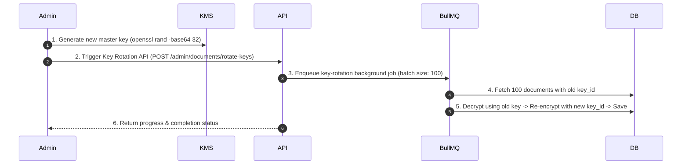

# Document Encryption & Key Rotation Protocol

This document details the architecture, AES-256-GCM PBKDF2 encryption model, and step-by-step key rotation procedures for the Harikson platform.

---

## 🔐 Encryption Architecture Overview

- **Algorithm:** AES-256-GCM (*Galois/Counter Mode* with 96-bit random IVs and 128-bit authentication tags).
- **Key Derivation:** PBKDF2 (`sha256`, 100,000 iterations) deriving document-specific 256-bit keys from `TENANT_MASTER_KEY` and salt `${documentId}:${keyId}`.
- **Key Storage:** Ciphertexts, IVs (`content_iv`), authentication tags (`content_tag`), and key version identifiers (`key_id`) are stored in `knowledge_documents`.
- **Master Key Security:** `TENANT_MASTER_KEY` is loaded exclusively from environment variables or KMS vaults. **No hardcoded fallback keys exist in the codebase.**

---

## 🔄 Step-by-Step Key Rotation Procedure

Key rotation re-encrypts stored document payloads with a new master key version without downtime.



### Step 1: Generate New Encryption Master Key

Generate a cryptographically secure 256-bit random key:
```bash
export NEW_TENANT_MASTER_KEY=$(openssl rand -base64 32)
```

### Step 2: Invoke Key Rotation API Endpoint

Call the key rotation admin endpoint with the target version tag (e.g., `v2`):

```bash
curl -X POST http://localhost:3008/admin/documents/rotate-keys \
  -H "Authorization: Bearer <ADMIN_JWT>" \
  -H "Content-Type: application/json" \
  -d '{"newKeyId": "v2"}'
```

### Step 3: Background Batch Processing (BullMQ)

The BullMQ `key-rotation` worker (`workers/scheduler.ts`) processes documents in batches of **100**:
1. Queries `knowledge_documents WHERE key_id != 'v2' LIMIT 100`.
2. Decrypts `content` using the active key for `key_id`.
3. Encrypts payload with `newKeyId` using `NEW_TENANT_MASTER_KEY`.
4. Atomically updates `content`, `content_iv`, `content_tag`, and `key_id = 'v2'`.
5. Caches decrypted payload in Redis with 1-hour TTL.

### Step 4: Verify Decryption Integrity

Verify that documents can be decrypted cleanly under the new key version:

```bash
curl -X GET http://localhost:3008/api/v1/documents/<DOCUMENT_ID> \
  -H "Authorization: Bearer <USER_JWT>"
```

### Step 5: Finalize Rotation

Once all rows in `knowledge_documents` have `key_id = 'v2'`:
1. Promote `NEW_TENANT_MASTER_KEY` to primary `TENANT_MASTER_KEY` in environment config / KMS.
2. Safely retire old key version.
