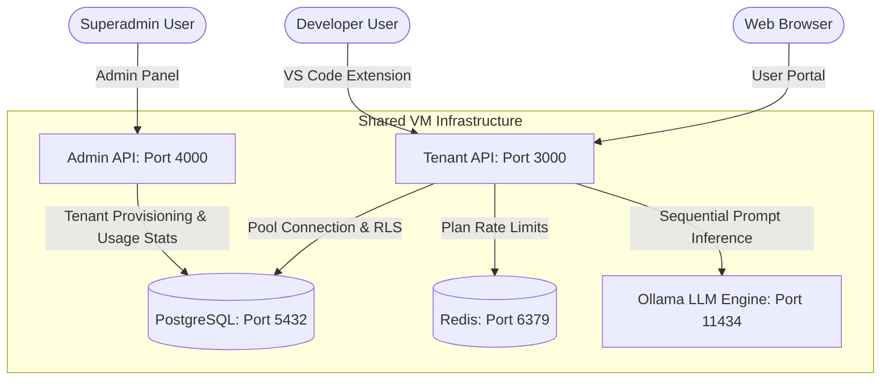

# Harikson Multi-Tenant AI Platform

Harikson is a high-performance, multi-tenant AI developer platform designed for cost-efficient, single-instance Virtual Machine (16GB RAM) deployments. The platform isolates tenant data using PostgreSQL Row-Level Security (RLS), throttles usage using plan-based Redis rate limits, and serves customized local LLMs via Ollama. It integrates with an IDE extension (VS Code) for inline ghost text autocompletions, developer sidebar chats, and interactive selection code reviews.

---

## 🏛️ System Architecture



---

## 📁 Repository Directory Structure

The codebase is organized into modular services:

*   **`init.sql`**: Bootstraps the PostgreSQL database. Enables `uuid-ossp`, RLS policies, auto-updating triggers, and session helper functions.
*   **`tenant-api/`**: The backend service handling chat generation, model catalogs, and auth scoped dynamically by tenant subdomain.
*   **`admin-api/`**: Separate admin service handling tenant creation (with database provisioning transactions), usage analytics, and VM capacity tracking.
*   **`user-portal/`**: Next.js user-facing web app. Includes the sandbox chat page (`user-portal/pages/chat.js`).
*   **`admin-panel/`**: Next.js admin dashboard page (`admin-panel/pages/dashboard.js`) rendering VM alerts, capacity graphs, and tenant controllers.
*   **`ide-extension/`**: VS Code extension files providing autocomplete triggers, sidebar consoles, diff panels, and status bar toggles.
*   **`model-builder/`**: Local template Modelfiles (`harikson-plus` and `harikson-max`) defining prompts and parameters.
*   **`scripts/`**: Shell scripts automating system checks, Docker updates, LLM pulls, test diagnostics, and VM deployments.

---

## 🔒 Multi-Tenant Row-Level Security (RLS)

Instead of running separate database containers per client, data privacy is enforced at the database layer using PostgreSQL RLS policies.

1.  **Context-Binding Function**:
    Every query checkout sets the PostgreSQL session parameter `app.current_tenant`:
    ```sql
    CREATE OR REPLACE FUNCTION set_tenant_context(tenant_id UUID)
    RETURNS VOID AS $$
    BEGIN
        PERFORM set_config('app.current_tenant', tenant_id::text, false);
    END;
    $$ LANGUAGE plpgsql;
    ```
2.  **RLS Isolation Policies**:
    RLS is enabled across all tables, filtering results to match the current session ID:
    ```sql
    CREATE POLICY tenant_isolation_policy ON messages
        FOR ALL
        USING (tenant_id = NULLIF(current_setting('app.current_tenant', true), '')::uuid)
        WITH CHECK (tenant_id = NULLIF(current_setting('app.current_tenant', true), '')::uuid);
    ```
3.  **API Connection Lifecycle (Anti-Leak)**:
    To prevent connection pool session variable leaks, the Tenant API queries the database using a strict checkout lifecycle wrapper:
    *   Acquire a client connection from the database pool.
    *   Set the tenant session context: `SELECT set_tenant_context($1)`.
    *   Execute the application query (data filtered by RLS).
    *   **Reset the tenant context to `NULL`**: `SELECT set_tenant_context(NULL)`.
    *   Release the client back to the pool.
    *   *Note: Database connections are released during long-running Ollama LLM requests to prevent connection starvation.*

---

## ⚡ Plan-Based Rate Limiting

The API throttles chat requests on a sliding 60-second window stored in Redis. The limit adapts dynamically to the tenant's subscription plan:
*   **Solo / Starter**: 10 requests per minute.
*   **Team / Pro**: 60 requests per minute.
*   **Business**: 300 requests per minute.
*   **Enterprise**: Unlimited (0).

---

## 🛠️ VS Code Extension Features

The `ide-extension` provides AI assistance directly in the editor:
1.  **Debounced Ghost Text Autocomplete**:
    Provides inline suggestions as you type. Employs a **300ms debounce** checking the cancellation token (`token.isCancellationRequested`) to discard queries if the user continues typing.
2.  **Webview Sidebar Chat**:
    A panel built with VS Code theme variables that sends user prompts to the tenant API and renders Markdown code answers with **"Copy"** clipboard buttons.
3.  **Command: Code Review Diff Editor**:
    Select code, run `Harikson: Review Selection`, and review suggested optimizations in a side-by-side **Diff Editor** pane.
4.  **Status Bar Controller**:
    Displays active model names and connection status (solid green for active, outline red for disconnected). Click the status bar to prompt a dropdown menu to swap model weights.

---

## 🚀 Setup & VM Deployment Guide

We provide four command-line tools under `scripts/` to automate deployment and management:

### 1. Model Downloader (`scripts/download-models.sh`)
Downloads base model weights and compiles branded models in Ollama:
```bash
./scripts/download-models.sh
```
*   Pulls `qwen2.5:7b` (Plus) and `qwen2.5:14b` (Max).
*   Registers custom system prompt behaviors and options.

### 2. Model Swap Manager (`scripts/model-manager.sh`)
Ollama loads models dynamically. On a 16GB RAM VM, running both 7B and 14B models simultaneously causes out-of-memory errors. The model manager ensures only one model is loaded:
```bash
# Load or switch active models (unloads the previous model first)
./scripts/model-manager.sh switch harikson-max

# Show active memory usage and loaded models
./scripts/model-manager.sh status

# Unload all models to free memory
./scripts/model-manager.sh unload
```

### 3. Comprehensive Diagnostics Suite (`scripts/test.sh`)
Verifies your platform health across 6 diagnostic layers:
```bash
./scripts/test.sh
```
*   **Infra**: Verifies Docker daemon status and checks that all 9 containers are running.
*   **Ollama**: Confirms port connections, checks model directories, and tests completions.
*   **PostgreSQL**: Confirms logins and queries `pg_policies` to verify RLS configuration.
*   **Tenant API**: Tests `/health`, `/api/models`, and sends a chat request to verify response text.
*   **Frontend**: Confirms Next.js ports respond.
*   **Stress Test**: Sends **10 concurrent requests** and measures response time.

### 4. Git Push & SSH VM Deployer (`scripts/deploy-to-vm.sh`)
Deploys local code changes directly to your remote VM:
```bash
./scripts/deploy-to-vm.sh
```
*   Stages and commits local code edits.
*   Pushes code updates to your GitHub repository.
*   Establishes an SSH connection to the Ace Cloud VM (`154.201.127.68`), pulls the fresh code, generates random environment secrets, runs migrations, triggers model downloads, and restarts containers.
