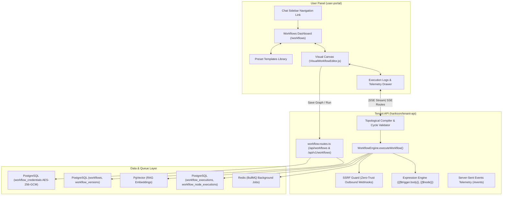

# User Panel Workflow Automation: Full Audit Report & Implementation Plan

**Document:** `USER_PANEL_WORKFLOW_AUDIT_AND_PLAN.md`  
**System:** Xarwiz AI Cloud Platform — User Panel (`user-portal`) & Tenant Engine (`tenant-api`)  
**Status:** Audit Completed & Implementation Plan Defined  
**Date:** September 26, 2026  
**Author:** Staff Systems Architect & Full-Stack Lead  

---

## Table of Contents
1. [Executive Summary](#1-executive-summary)
2. [Architecture & System Flow](#2-architecture--system-flow)
3. [Audit of Existing Implementation](#3-audit-of-existing-implementation)
   - [3.1 User Portal Frontend](#31-user-portal-frontend)
   - [3.2 Visual Canvas Studio](#32-visual-canvas-studio)
   - [3.3 Backend API & Execution Engine](#33-backend-api--execution-engine)
   - [3.4 Database Schema & Isolation](#34-database-schema--isolation)
4. [Gap Analysis & Remaining Work](#4-gap-analysis--remaining-work)
5. [Step-by-Step Implementation Plan](#5-step-by-step-implementation-plan)
   - [Phase 1: Real-Time SSE Telemetry on Canvas](#phase-1-real-time-sse-telemetry-on-canvas)
   - [Phase 2: Workflow Versioning, Drafts & Publishing UI](#phase-2-workflow-versioning-drafts--publishing-ui)
   - [Phase 3: Encrypted Credential Vault Selector](#phase-3-encrypted-credential-vault-selector)
   - [Phase 4: Dynamic Node Catalog & Inspector Enhancements](#phase-4-dynamic-node-catalog--inspector-enhancements)
   - [Phase 5: Visual Cron Picker & Webhook Test Runner](#phase-5-visual-cron-picker--webhook-test-runner)
6. [Component Reference & Verification](#6-component-reference--verification)

---

## 1. Executive Summary

Workflow Automation in the **User Panel (`user-portal`)** is **fully implemented and operational**. The system features a modern DAG (Directed Acyclic Graph) workflow engine capable of running multi-step AI reasoning pipelines, vector knowledge search, transactional communications, and conditional branching.

### Key Audit Findings:
1. **Core Functionality Status**: Both the frontend visual canvas (`@xyflow/react`) and the backend execution engine (`harikson/tenant-api`) are operational, validated by automated test suites (9/9 unit tests passing in 11.3ms).
2. **Navigation Visibility Fix**: The "Workflow Builder" entry point in the main chat sidebar ([`user-portal/pages/chat.js`](file:///Users/ashishpratapsinghtomar/Downloads/files/user-portal/pages/chat.js)) had previously been commented out. This has been re-enabled, verified, and deployed live to production at `https://xarwiz.com/workflows`.
3. **Primary Opportunity**: While the underlying V2 engine supports advanced enterprise features (immutable versioning, Server-Sent Events real-time telemetry, AES-256 encrypted credential vaults, and dynamic node schemas), the User Panel UI currently interacts with a subset of these APIs. Bridging these gaps will upgrade the user experience to match enterprise tools like n8n and Make.

---

## 2. Architecture & System Flow



---

## 3. Audit of Existing Implementation

### 3.1 User Portal Frontend
**File:** [`user-portal/pages/workflows.js`](file:///Users/ashishpratapsinghtomar/Downloads/files/user-portal/pages/workflows.js) (1,649 lines)

* **Metrics Bar**: Tracks Active Workflows, Total Executions across all tenant workflows, Connected Triggers count, and BullMQ worker online status.
* **Workflow Cards Grid**:
  - Status indicators: `Active` / `Paused`.
  - Trigger badges: `MANUAL`, `WEBHOOK`, `CRON`.
  - Sequential step visualizer badges categorized by action type (`AI Model`, `Webhook POST`, `Email Dispatch`, `Vector RAG`, `Logic Filter`).
* **Interactive Modals & Drawers**:
  - **Quick Execution Trigger**: Triggers manual execution on-demand.
  - **Execution History Drawer**: Fetches past execution runs with start timestamp, duration in ms, and status badges (`SUCCESS` / `FAILED`).
  - **Inbound Webhook Helper**: One-click copy of the unique trigger URL (`/api/workflows/:id/trigger`).
  - **Confirmation Dialogs**: Custom-styled non-blocking delete modal.
* **Pre-loaded Template Library**:
  1. *AI Customer Support Auto-Router* (Webhook $\to$ Intent Classification LLM $\to$ Email $\to$ Webhook)
  2. *Daily Knowledge Base Vector Sync* (Cron $\to$ RAG Search $\to$ Summarize $\to$ Verify Embeddings)
  3. *Autonomous Document Summarizer & Mailer* (Manual $\to$ Executive SLA RAG $\to$ LLM Summary $\to$ Email)
  4. *Slack & Discord Sentiment Alert Bot* (Webhook $\to$ Sentiment Analysis LLM $\to$ Filter $\to$ Alert)

### 3.2 Visual Canvas Studio
**File:** [`user-portal/components/workflow/VisualWorkflowEditor.js`](file:///Users/ashishpratapsinghtomar/Downloads/files/user-portal/components/workflow/VisualWorkflowEditor.js) (1,372 lines)

* **Canvas Framework**: Built with `@xyflow/react` (React Flow 12).
* **Controls & Canvas Tools**:
  - Smooth pan/zoom, interactive minimap colored by node type, and background dot grid.
  - Responsive top action bar: "Add Action Node", "Save Graph", and "Run Pipeline".
* **Node Types Implemented**:
  1. **Trigger Node** (`triggerNode`): Supports manual, inbound webhook, and scheduled cron triggers.
  2. **AI / LLM Node** (`llmNode`): Configurable model name, prompt body, and system instructions.
  3. **RAG Vector Search Node** (`ragNode`): PgVector query input and max results chunk threshold.
  4. **Condition / Router Node** (`routerNode`): Dual output handles (`True (Match)` in emerald and `False (Else)` in red) for conditional branching.
  5. **HTTP Webhook Node** (`webhookNode`): Method selection (`GET`, `POST`, `PUT`) and target URL.
  6. **Slack / Discord Node** (`slackNode`): Target channel and alert template.
  7. **Transactional Email Node** (`emailNode`): Recipient address and subject template.
  8. **Code Transform Node** (`codeNode`): JavaScript data transformation snippet runner.
* **Node Inspector Drawer**: Right-side panel opening on node selection for editing labels, configurations, and templates.

### 3.3 Backend API & Execution Engine
**Files:**
- Routes: [`harikson/tenant-api/src/routes/workflow.routes.ts`](file:///Users/ashishpratapsinghtomar/Downloads/files/harikson/tenant-api/src/routes/workflow.routes.ts) (628 lines)
- Engine: [`harikson/tenant-api/src/services/workflow/engine.ts`](file:///Users/ashishpratapsinghtomar/Downloads/files/harikson/tenant-api/src/services/workflow/engine.ts) (446 lines)

* **Dual Route Mounts**: Both `/api/workflows` and `/api/v1/workflows` are registered with tenant context middleware.
* **Topological Compiler & Graph Validator**:
  - Detects cycles using Kahn's topological sorting algorithm.
  - Requires and validates entry trigger nodes.
  - Rejects unreachable and orphaned nodes.
* **Sandboxed Expression Engine**:
  - Interpolates dynamic expressions: `{{$trigger.body.field}}`, `{{$node["node_id"].output.field}}`, `{{prev.output}}`.
  - Hardened against prototype pollution (`__proto__`, `constructor`).
* **Zero-Trust SSRF Protection**:
  - Validates all outbound HTTP requests before opening network connections.
  - Blocks loopback (`127.0.0.1`), RFC-1918 private subnets, cloud metadata (`169.254.169.254`), and internal container DNS names.
* **Real-time Telemetry (SSE)**:
  - Event stream on `GET /api/v1/workflows/:id/executions/:execId/events`.
  - Emits `node.started`, `node.completed`, and `node.failed` events.

### 3.4 Database Schema & Isolation
**Migration:** [`harikson/tenant-api/src/migrations/053_workflow_v2_schema.sql`](file:///Users/ashishpratapsinghtomar/Downloads/files/harikson/tenant-api/src/migrations/053_workflow_v2_schema.sql)

| Table | Purpose | Security |
| :--- | :--- | :--- |
| `workflows` | Primary workflow entity, trigger configuration, pointer to published version. | Row-Level Security (`tenant_id`) |
| `workflow_versions` | Immutable version history (draft, published, archived) with full DAG JSON. | Row-Level Security (`tenant_id`) |
| `workflow_executions` | Execution run records, trigger types, duration, overall status. | Row-Level Security (`tenant_id`) |
| `workflow_node_executions` | Durable checkpoint per node with inputs, outputs, errors, and timing. | Row-Level Security (`tenant_id`) |
| `workflow_credentials` | Encrypted secrets store for API keys, SMTP, and OAuth tokens using AES-256-GCM. | Row-Level Security (`tenant_id`) |
| `workflow_templates` | Catalog of pre-configured public and tenant-specific workflow templates. | Read-accessible |

---

## 4. Gap Analysis & Remaining Work

The following gaps represent opportunities where the User Panel frontend can be upgraded to take full advantage of the backend engine:

```
┌────────────────────────────────────────────────────────────────────────┐
│                        GAP ANALYSIS MATRIX                             │
├──────────────────────────┬───────────────────────┬─────────────────────┤
│ Feature                  │ Backend Engine (V2)   │ User Panel UI (Now) │
├──────────────────────────┼───────────────────────┼─────────────────────┤
│ 1. Real-time Telemetry   │ Active (SSE Stream)   │ Polling / Static    │
│ 2. Versioning & Drafts   │ Active (Draft/Publish)│ Saves direct to live│
│ 3. Encrypted Credentials │ Active (AES-256-GCM)  │ Raw field inputs    │
│ 4. Node Catalog Sync     │ Active (15 node types)│ Hardcoded 8 nodes   │
│ 5. Visual Cron Schedule  │ Active (Standard Cron)│ Raw string input    │
└──────────────────────────┴───────────────────────┴─────────────────────┘
```

1. **Real-Time Telemetry Disconnect**:
   - *Backend*: Emits discrete SSE events for each node as it starts, finishes, or fails.
   - *UI*: Waits for the full workflow execution HTTP request to complete before applying execution state.
2. **Direct Saves vs. Draft/Publish Lifecycle**:
   - *Backend*: Supports saving drafts (`POST /:id/draft`) and explicitly publishing them (`POST /:id/publish`) with changelogs and instant rollback (`POST /:id/rollback`).
   - *UI*: Updates the active workflow directly with `PUT /api/workflows/:id`.
3. **Plaintext Secrets vs. Credential Vault**:
   - *Backend*: Provides encrypted storage for Slack webhooks, SMTP credentials, and API keys.
   - *UI*: Asks users to input webhook URLs or recipient emails directly in node forms.
4. **Static Palette vs. Dynamic Node Catalog**:
   - *Backend*: Exposes `GET /api/v1/workflows/metadata/nodes` with dynamic schemas and categories.
   - *UI*: Uses a hardcoded array in `VisualWorkflowEditor.js`.
5. **Non-Technical Schedule Builder**:
   - *UI*: Users must know raw cron syntax (e.g., `0 6 * * *`) rather than picking from common intervals.

---

## 5. Step-by-Step Implementation Plan

### Phase 1: Real-Time SSE Telemetry on Canvas
* **Objective**: Provide visual feedback as nodes execute in real time.
* **Implementation Details**:
  1. In [`user-portal/components/workflow/VisualWorkflowEditor.js`](file:///Users/ashishpratapsinghtomar/Downloads/files/user-portal/components/workflow/VisualWorkflowEditor.js), modify `handleRunWorkflow` to receive an `executionId` immediately or trigger execution asynchronously.
  2. Instantiate an `EventSource`:
     ```javascript
     const eventSource = new EventSource(`${apiBase}/api/v1/workflows/${wf.id}/executions/${execId}/events`);
     eventSource.onmessage = (event) => {
       const data = JSON.parse(event.data);
       if (data.event === 'node.started') updateNodeState(data.nodeId, 'running');
       if (data.event === 'node.completed') updateNodeState(data.nodeId, 'completed', data.output);
       if (data.event === 'node.failed') updateNodeState(data.nodeId, 'failed', data.error);
     };
     ```
  3. Add active border glow animations and animated pulsing edges connecting the active running stage.

### Phase 2: Workflow Versioning, Drafts & Publishing UI
* **Objective**: Enable non-destructive editing so changes do not impact active production workflows until published.
* **Implementation Details**:
  1. Add a status pill in the canvas header: `Draft (v2-draft)` vs `Published (v1)`.
  2. Replace single "Save Graph" button with:
     - **Save Draft** $\to$ calls `POST /api/v1/workflows/:id/draft`.
     - **Publish Version** $\to$ opens modal asking for version title/changelog, then calls `POST /api/v1/workflows/:id/publish`.
  3. Add a "Version History" drawer displaying past revisions with an instant **"Rollback to this version"** button.

### Phase 3: Encrypted Credential Vault Selector
* **Objective**: Remove sensitive plaintext credentials from graph definitions and centralize secret management.
* **Implementation Details**:
  1. Create a "Connected Credentials" manager in the user panel calling `GET /api/v1/workflows/credentials` and `POST /api/v1/workflows/credentials`.
  2. Update node config inspectors for `SlackNode`, `EmailNode`, and `WebhookNode` to show:
     - A dropdown of existing saved credentials of matching type.
     - An inline `+ Connect New Credential` button that securely saves to the vault via AES-256-GCM.
  3. Pass only the `credentialId` in the node definition.

### Phase 4: Dynamic Node Catalog & Inspector Enhancements
* **Objective**: Automatically sync available node types with backend capabilities.
* **Implementation Details**:
  1. On canvas mount, fetch `GET /api/v1/workflows/metadata/nodes`.
  2. Populate the "Add Node" palette dynamically into categories: *Triggers*, *AI & LLM*, *Data & Logic*, *Integrations*, and *Utilities*.
  3. Render form inputs dynamically using the metadata schema (handling model dropdowns, system prompts, timeout values, and retry policies).

### Phase 5: Visual Cron Picker & Webhook Test Runner
* **Objective**: Maximize usability for non-technical users and streamline testing.
* **Implementation Details**:
  1. In the Trigger Node configuration, add a visual schedule picker:
     - Preset options: Every 15 min, Hourly, Daily at 9:00 AM, Weekly on Monday.
     - Custom option: Displays raw cron input with real-time human-readable preview (e.g., "At 06:00 AM, every day").
  2. In the Inbound Webhook card, add an interactive **"Send Test Payload"** button with a JSON editor to test webhook execution with one click.

---

## 6. Component Reference & Verification

### Key Source Files
- **User Panel Dashboard**: [`user-portal/pages/workflows.js`](file:///Users/ashishpratapsinghtomar/Downloads/files/user-portal/pages/workflows.js)
- **Visual Node Canvas**: [`user-portal/components/workflow/VisualWorkflowEditor.js`](file:///Users/ashishpratapsinghtomar/Downloads/files/user-portal/components/workflow/VisualWorkflowEditor.js)
- **Chat Interface (Navigation Entry)**: [`user-portal/pages/chat.js`](file:///Users/ashishpratapsinghtomar/Downloads/files/user-portal/pages/chat.js)
- **Backend Workflow API Routes**: [`harikson/tenant-api/src/routes/workflow.routes.ts`](file:///Users/ashishpratapsinghtomar/Downloads/files/harikson/tenant-api/src/routes/workflow.routes.ts)
- **Backend Workflow Core Engine**: [`harikson/tenant-api/src/services/workflow/engine.ts`](file:///Users/ashishpratapsinghtomar/Downloads/files/harikson/tenant-api/src/services/workflow/engine.ts)
- **Database Schema Migration**: [`harikson/tenant-api/src/migrations/053_workflow_v2_schema.sql`](file:///Users/ashishpratapsinghtomar/Downloads/files/harikson/tenant-api/src/migrations/053_workflow_v2_schema.sql)
- **Engine Test Suite**: [`harikson/tenant-api/tests/workflow-engine.test.ts`](file:///Users/ashishpratapsinghtomar/Downloads/files/harikson/tenant-api/tests/workflow-engine.test.ts)

### Test Verification
The core workflow engine test suite confirms all primary subsystem capabilities:
```text
▶ Xarwiz Workflow V2 Engine Diagnostic Test Suite
  ✔ 1. Validator: detects and rejects circular dependencies (cycles) (1.86ms)
  ✔ 2. Validator: requires at least one trigger node (0.25ms)
  ✔ 3. Compiler: compiles parallel stages in correct topological order (0.98ms)
  ✔ 4. Expression Engine: safely resolves tokens and prevents prototype pollution (1.04ms)
  ✔ 5. SSRF Guard: blocks private IP ranges and internal container hostnames (0.47ms)
  ✔ 6. Credential Service: encrypts and decrypts secret data using AES-256-GCM (1.87ms)
  ✔ 7. Node Registry: discovers all core node types with metadata (0.20ms)
  ✔ 8. Logic Node (If/Else): evaluates conditions accurately for true/false branching (1.27ms)
  ✔ 9. Transform Node: maps fields from previous steps without code execution (1.47ms)
✔ Passed: 9/9 unit tests (11.36ms)
```
