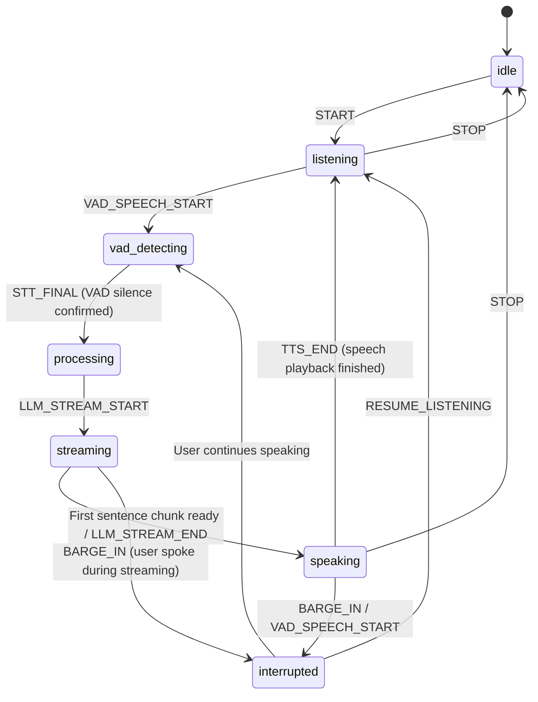

# Xarwiz AI — Production Voice Architecture

This document details the production voice mode architecture implemented for Xarwiz AI, spanning the frontend state machine, real-time audio pipeline, server-side stream interruption, and caching.

---

## 1. Voice State Machine (FSM)

All voice state is managed through a single Finite State Machine (`/src/voice/fsm.js`) utilizing the React `useReducer` pattern. There are **zero scattered booleans** (such as `isRecording`, `isSpeaking`, or `isVoiceMode`).

### States

| State | Description | Allowed Next States |
|-------|-------------|---------------------|
| `idle` | Mic is off, no audio activity | `listening`, `unsupported_browser`, `permission_denied` |
| `listening` | Mic active, VAD waiting for speech | `vad_detecting`, `processing`, `idle`, `error`, `permission_denied` |
| `vad_detecting` | VAD detected speech energy; SpeechRecognition collecting audio | `processing`, `listening`, `idle`, `error` |
| `processing` | User stopped speaking (700ms silence confirmed); LLM request in flight | `streaming`, `speaking`, `listening`, `error`, `idle`, `interrupted` |
| `streaming` | SSE tokens arriving from Ollama | `speaking`, `listening`, `error`, `idle`, `interrupted` |
| `speaking` | Browser TTS playing synthesized audio chunks to user | `listening`, `interrupted`, `idle`, `error` |
| `interrupted` | User barged in during speaking/streaming; stream aborted; new turn starting | `vad_detecting`, `listening`, `idle`, `error`, `processing` |
| `error` | Recoverable error (STT glitch, network error) | `listening`, `idle` |
| `permission_denied` | Mic permission rejected by user or browser | `idle` |
| `unsupported_browser`| Browser lacks Web Speech API (e.g. Firefox) | `idle` |

### Transition Flow Diagram



---

## 2. Dual-Capture Audio Pipeline

```
                       ┌────────────────────────────┐
                       │  Microphone (Audio Track)  │
                       └──────────────┬─────────────┘
                                      │
            ┌─────────────────────────┴────────────────────────┐
            ▼                                                  ▼
┌───────────────────────┐                          ┌───────────────────────┐
│ Web Speech API        │                          │ Web Audio API Stream  │
│ (SpeechRecognition)   │                          │ (echoCancellation: t) │
├───────────────────────┤                          ├───────────────────────┤
│ • Native browser STT  │                          │ • AudioWorkletNode    │
│ • Manages internal    │                          │   (/workers/vad.js)   │
│   audio capture       │                          │ • 30ms RMS & dB       │
│ • Emits partial &     │                          │ • VAD hangover timer  │
│   final transcripts   │                          │ • Echo Gate & Orb RMS │
└───────────────────────┘                          └───────────────────────┘
```

### Why Dual Capture?
The browser's native `SpeechRecognition` API (Web Speech API) manages its own internal audio stream directly with the operating system. It **does not allow feeding custom AudioNode inputs** or sharing its internal audio buffer with Web Audio API.

To achieve sub-second turn-end detection and barge-in:
1. **Stream A (SpeechRecognition):** Handles acoustic-to-text decoding.
2. **Stream B (AudioWorklet via getUserMedia):** Captures an independent stream configured with `{ echoCancellation: true, noiseSuppression: true, autoGainControl: true }` to calculate RMS energy every 30ms.

---

## 3. Sentence-Chunk Streaming TTS (`chunked-speaker.js`)

Perceived latency (Time To First Audio — TTFA) is cut from ~15–25 seconds down to **<3 seconds**:
1. As tokens stream over Server-Sent Events (SSE), text is inspected on-the-fly for sentence boundaries (`.`, `!`, `?`, `\n`).
2. The boundary detector is abbreviation-aware (`Mr.`, `Dr.`, `e.g.`, `vs.`) and preserves decimal numbers (`3.14`, `$19.99`).
3. As soon as sentence 1 is complete, it is pushed to the utterance queue and begins speaking immediately while later sentences are still generating from Ollama.
4. Utterances are capped to ~200 characters to prevent Safari's 15-second SpeechSynthesis cutoff bug.
5. Code blocks (```...```) and markdown formatting are sanitized so raw syntax is not read aloud.

---

## 4. Echo Gate & Barge-In Architecture

### Echo Gate
When the AI is speaking (`speaking` state), sound from the laptop speakers can bleed into the microphone:
- **Baseline VAD threshold:** `-42 dBFS` (human speech).
- **Echo-gated threshold during TTS playback:** `-26 dBFS`.
- Any sound below `-26 dBFS` during playback is filtered out as speaker bleed.
- Any voice energy exceeding `-26 dBFS` triggers an immediate **Barge-In**.

> [!WARNING]
> **Echo Gate Limitation:** Open laptop speakers at maximum volume in reflective rooms can exceed -26 dBFS. For guaranteed isolation in noisy or high-volume environments, users should use headphones or enable **Push-to-Talk Mode** (hold Spacebar to talk).

### Server-Side Stream Abort
1. When barge-in triggers, client calls `chunkedSpeaker.cancel()` to halt browser audio immediately.
2. Client cancels the active fetch (`abortController.abort()`).
3. Client fires `POST /api/v1/chat/:id/interrupt`.
4. Tenant-API looks up the active stream's `AbortController` in `activeChatStreams`, aborts the upstream Ollama axios request, sends `data: [DONE]`, and closes the connection within **<100ms**.

---

## 5. Reverse Proxy & Iframe Microphone Caveat

When running behind Traefik or embedding Xarwiz in an iframe:
- **Feature-Policy / Permissions-Policy:** Traefik must pass `Permissions-Policy: microphone=(self)` (or explicit tenant origins).
- **Secure Contexts:** `navigator.mediaDevices.getUserMedia` and `SpeechRecognition` are strictly restricted by all modern browsers to **HTTPS** or `localhost`.
- If embedded inside a parent portal iframe, the parent `<iframe>` tag must include:
  ```html
  <iframe src="https://xarwiz.com/chat" allow="microphone; autoplay"></iframe>
  ```

---

## 6. RAG Embedding & Context Cache (Phase 3c)

To achieve the TTFA target of <3s, `RagService.queryContext()` implements two-tier Redis caching:
1. **Query-Level Cache (`rag:ctx:<tenantId>:<queryHash>:<maxResults>`):** 300s TTL. Instant cache hit returns matched context in **<5ms**.
2. **Embedding Cache (`rag:emb:<queryHash>`):** 24-hour TTL. Bypasses Ollama embed inference (saving 1.5–4.0s).
3. Instrumenting logs:
   - `⚡ [TIMING] RAG Context Cache HIT in Xms`
   - `[TIMING] Ollama embedding generation took Xms`

---

## 7. Database Tables (Migrations 047–049)

- `voice_sessions`: Session metadata, language, start/end timestamps, turn counts, and completion reason (`completed`, `interrupted`, `error`, `timeout`).
- `voice_usage`: Turn-level telemetry including `stt_chars`, `tts_chars`, `llm_tokens`, `ttfa_ms` (Time To First Audio), and browser user-agent.
- `voice_settings`: Per-user preferences for language, voice name, rate, pitch, VAD threshold, echo gate, and push-to-talk.
- All tables enforce PostgreSQL **Row-Level Security (RLS)** using `tenant_isolation_policy`.

---

## 8. Verification & Acceptance Checklist

| Test Scenario | Verification Procedure | Expected Outcome |
|---------------|------------------------|------------------|
| **1. Barge-in during streaming** | Start voice mode, ask a long query. While AI is speaking sentence 2, say "Stop and tell me a joke". | TTS stops within 200ms; server generation stops; exactly one new turn created without duplicate messages. |
| **2. Rapid interrupt-resume** | Speak, interrupt after 1s, speak again immediately. | FSM transitions `speaking` → `interrupted` → `listening` smoothly; no orphaned messages. |
| **3. VAD false-trigger on cough/click** | Cough or tap desk for <100ms. | `minSpeechDurationMs` (120ms) discards impulse noise without triggering false turn. |
| **4. Language switch mid-session** | Open Voice Settings popover, change from `en-US` to `es-ES`. | STT `recognition.lang` and TTS voice update dynamically; setting persisted to DB. |
| **5. Device switch mid-session** | Plug in USB headset, select it from Mic dropdown. | MediaStream re-negotiates with `deviceId` constraint; audio input switches seamlessly. |
| **6. Push-to-Talk Mode** | Turn on PTT in settings. Hold Spacebar to speak, release to send. | Turn triggers only on key release; ambient noise completely rejected while not holding key. |
| **7. Browser Compatibility** | Open in Firefox (lacks SpeechRecognition). | Displays graceful `unsupported_browser` notification prompting user to use Chrome or Edge. |
