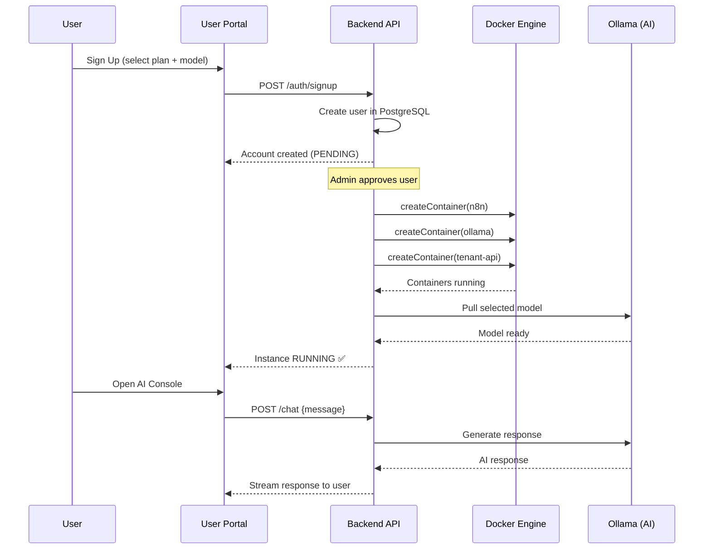
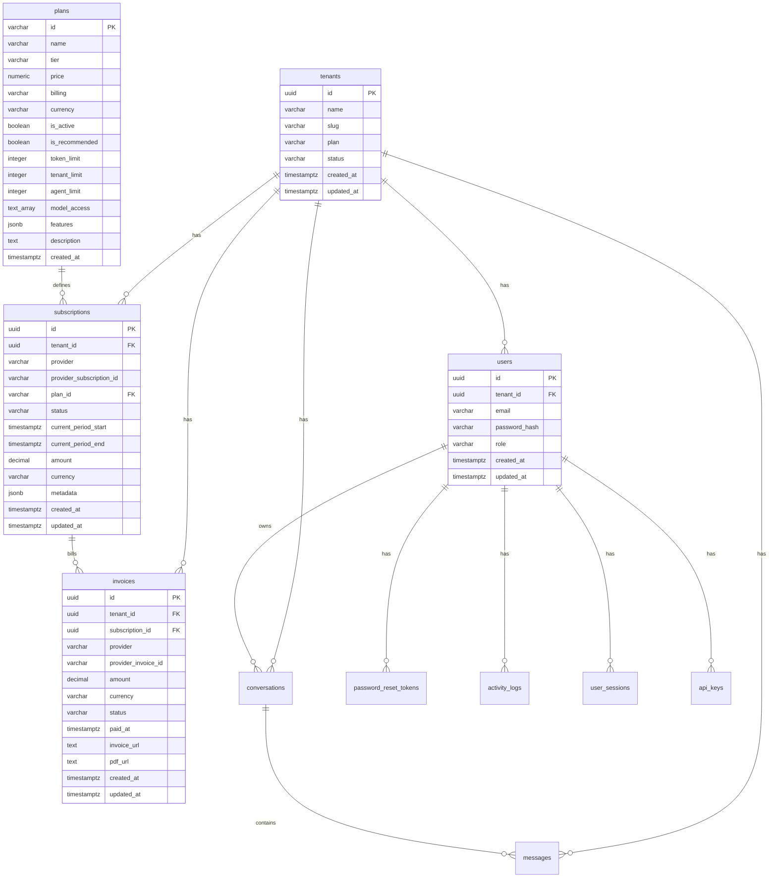

<p align="center">
  
  
  
</p>

<h1 align="center">🧠 Harikson AI Platform</h1>
<h3 align="center"><em>White-Label, Self-Hosted AI Agent Infrastructure — Built on Neuravolt</em></h3>

<p align="center">
  Deploy isolated, branded AI agent stacks for every customer.<br/>
  No OpenAI dependency. No per-token billing. Complete data sovereignty.
</p>

---

## 📌 What is Harikson?

**Harikson** is a **multi-tenant AI agent platform** built on top of the [Neuravolt](https://neuravolt.cloud) infrastructure. It enables businesses to offer **white-labeled, containerized AI agents** — each running in a fully isolated Docker environment with its own LLM inference engine.

Think of it as **"Vercel for AI Agents"** — but self-hosted, privacy-first, and with zero per-token API costs.

### The Problem We Solve

| Traditional AI (OpenAI/Claude APIs) | Harikson |
|--------------------------------------|----------|
| 💸 Per-token billing (costs explode at scale) | ✅ Fixed monthly infrastructure cost |
| 🔓 Data leaves your servers | ✅ 100% on-premise — data never leaves |
| 🎭 Same model for everyone | ✅ White-labeled, branded AI per customer |
| 😬 Rate limits & downtime risks | ✅ Dedicated compute per tenant |
| 🚫 No customization | ✅ Fine-tuning with QLoRA, custom RAG |

---

## 🏗️ Architecture Overview

```
┌──────────────────────────────────────────────────────────────┐
│                    NEURAVOLT CONTROL PLANE                    │
│  ┌──────────┐  ┌──────────┐  ┌──────────┐  ┌──────────────┐ │
│  │ Traefik  │  │ Backend  │  │  Admin   │  │  User Portal │ │
│  │  Proxy   │  │   API    │  │  Panel   │  │  (Next.js)   │ │
│  │  + SSL   │  │ (Hono)   │  │(Next.js) │  │              │ │
│  └──────────┘  └──────────┘  └──────────┘  └──────────────┘ │
│  ┌──────────┐  ┌──────────┐  ┌──────────────────────────┐   │
│  │ Postgres │  │  Redis   │  │  Monitoring (Prometheus  │   │
│  │   (DB)   │  │ (Queue)  │  │  Grafana / Loki / cAdv)  │   │
│  └──────────┘  └──────────┘  └──────────────────────────┘   │
└──────────────────────────────────────────────────────────────┘
                           │
            ┌──────────────┼──────────────┐
            ▼              ▼              ▼
  ┌─────────────┐  ┌─────────────┐  ┌─────────────┐
  │  TENANT A   │  │  TENANT B   │  │  TENANT C   │
  │ ┌─────────┐ │  │ ┌─────────┐ │  │ ┌─────────┐ │
  │ │Tenant   │ │  │ │Tenant   │ │  │ │Tenant   │ │
  │ │API      │ │  │ │API      │ │  │ │API      │ │
  │ │(Node.js)│ │  │ │(Node.js)│ │  │ │(Node.js)│ │
  │ └─────────┘ │  │ └─────────┘ │  │ └─────────┘ │
  │ ┌─────────┐ │  │ ┌─────────┐ │  │ ┌─────────┐ │
  │ │ Ollama  │ │  │ │ Ollama  │ │  │ │ Ollama  │ │
  │ │(LLM AI) │ │  │ │(LLM AI) │ │  │ │(LLM AI) │ │
  │ └─────────┘ │  │ └─────────┘ │  │ └─────────┘ │
  │ ┌─────────┐ │  │ ┌─────────┐ │  │ ┌─────────┐ │
  │ │  n8n    │ │  │ │  n8n    │ │  │ │  n8n    │ │
  │ │(Automat)│ │  │ │(Automat)│ │  │ │(Automat)│ │
  │ └─────────┘ │  │ └─────────┘ │  │ └─────────┘ │
  └─────────────┘  └─────────────┘  └─────────────┘
     Isolated          Isolated          Isolated
```

**Every tenant gets:**
- 🐳 **Isolated Docker containers** (no shared resources)
- 🤖 **Dedicated Ollama instance** (private LLM inference)
- ⚡ **Private n8n automation** (workflow engine)
- 🎨 **White-label branding** (custom logo, colors, welcome message)
- 📊 **Resource monitoring** (CPU, RAM, disk per tenant)

---

## 🧬 Tech Stack

| Layer | Technology | Purpose |
|-------|-----------|---------|
| **Proxy & SSL** | Traefik v2.11 | Auto-SSL, subdomain routing (`tenant.neuravolt.cloud`) |
| **Backend API** | Hono + Node.js + TypeScript | Tenant provisioning, auth, billing, Docker orchestration |
| **Database** | PostgreSQL 15 + Prisma ORM | Users, instances, invoices, plans, fine-tune jobs |
| **Cache & Queue** | Redis 7 | Session caching, job queue, rate limiting |
| **AI Inference** | Ollama (per-tenant) | Local LLM serving — no cloud API needed |
| **Model Pipeline** | Python + HuggingFace + GGUF | Download → Quantize → Brand → Distribute |
| **Automation** | n8n (per-tenant) | Visual workflow engine for AI-powered automations |
| **User Portal** | Next.js 14 | Customer dashboard, signup, AI console |
| **Admin Panel** | Next.js 14 | Approve users, manage instances, view metrics |
| **IDE Extension** | VS Code Extension (TypeScript) | Ghost-text autocomplete, sidebar AI chat |
| **IDE Bridge** | Socket.io + Node.js | WebSocket relay between IDE ↔ Tenant API |
| **Monitoring** | Prometheus + Grafana + Loki + cAdvisor + Dozzle | Full-stack observability |

---

## 🤖 Branded Model Catalog

Harikson ships its own **branded model names** that map to production-grade open-source models. Customers see "Harikson" — they never know the underlying model.

### Starter Plan — 8 GB RAM

| Harikson Model Name | Base Model | VRAM Usage | Type |
|---------------------|-----------|------------|------|
| `harikson-coder-7b` | Qwen2.5-Coder 7B | 5–6 GB | Coding |
| `harikson-coder-v2-lite` | DeepSeek-Coder V2 Lite | 6–8 GB | Coding |
| `harikson-codegemma-7b` | CodeGemma 7B | 5–6 GB | Coding |
| `harikson-chat-8b` | Qwen 2.5 7B | 5–6 GB | Chat |
| `harikson-llama-3.1-8b` | Llama 3.1 8B | 5–6 GB | Chat |
| `harikson-gemma-3-4b` | Gemma 2 2B | 3–4 GB | Chat |
| `harikson-mistral-7b` | Mistral 7B Instruct | 5–6 GB | Chat |

### Pro Plan — 12 GB RAM

| Harikson Model Name | Base Model | VRAM Usage | Type |
|---------------------|-----------|------------|------|
| `harikson-coder-14b` | Qwen2.5-Coder 14B | 10–12 GB | Coding |
| `harikson-coder-16b` | DeepSeek-Coder 16B | 10–12 GB | Coding |
| `harikson-chat-14b` | Qwen 2.5 14B | 10–12 GB | Chat |
| `harikson-gemma-3-12b` | Gemma 2 9B | 9–11 GB | Chat |

### Business Plan — 16 GB RAM

| Harikson Model Name | Base Model | VRAM Usage | Type |
|---------------------|-----------|------------|------|
| `harikson-chat-30b-a3b` | Qwen 2.5 32B | 10–14 GB | Chat (MoE) |

### Enterprise Plan — 24 GB RAM

| Harikson Model Name | Base Model | VRAM Usage | Type |
|---------------------|-----------|------------|------|
| `harikson-coder-32b` | Qwen2.5-Coder 32B | 20–24 GB | Coding |
| `harikson-coder-v2` | DeepSeek-Coder V2 | 20–24 GB | Coding |
| `harikson-chat-32b` | Qwen 2.5 32B | 20–24 GB | Chat |
| `harikson-chat-35b-a3b` | Qwen 2.5 32B (MoE) | 6–8 GB | Chat |
| `harikson-chat-32b-instruct` | Qwen 2.5 32B Instruct | 20–24 GB | Chat |

> All models are **4-bit quantized (Q4_K_M)** for optimal performance vs. quality tradeoff.

---

## 🚀 How Tenant Provisioning Works



**Provisioning creates 3 containers per tenant:**

| Container | Image | Purpose |
|-----------|-------|---------|
| `harikson-tenant-{name}-api` | `node:18-alpine` | Tenant API gateway, chat routing, RAG |
| `harikson-tenant-{name}-ai` | `ollama/ollama:latest` | Private LLM inference engine |
| `nv-instance-{name}` | `n8nio/n8n:latest` | Workflow automation engine |

---

## 🎯 Key Features

### 1. 🐳 Docker-Isolated Multi-Tenancy
Every customer runs in fully isolated containers with resource limits (CPU, RAM, storage) enforced per plan. No noisy neighbors. No data leakage.

### 2. 🤖 Private LLM Inference
Each tenant gets a dedicated Ollama instance. Models run **locally** — no tokens leave the server. Zero API costs after initial VPS investment.

### 3. 🏷️ White-Label Branding
Customers interact with "Harikson AI" — never seeing Qwen, Llama, or DeepSeek branding. Custom logos, colors, and welcome messages per tenant.

### 4. 🧪 Model Pipeline (Build → Sign → Distribute)
```
HuggingFace → Download → GGUF Convert → Quantize → Ollama Create → Sign → Distribute to VPS nodes
```

### 5. ⚡ n8n Workflow Automation
Each tenant gets a private n8n instance for building AI-powered workflows — email automation, CRM integrations, webhook processing, and more.

### 6. 🖥️ VS Code Extension
Ghost-text autocomplete and sidebar AI chat — powered by the tenant's own LLM through a WebSocket IDE Bridge.

### 7. 📊 Full Observability
Real-time metrics with Prometheus + Grafana, centralized logging with Loki + Promtail, container monitoring with cAdvisor, and live log streaming with Dozzle.

### 8. 📄 RAG & Fine-Tuning (Planned)
- **RAG**: Upload documents (PDF, DOCX, codebases) → index → query with AI
- **QLoRA Fine-Tuning**: Train custom adapters on tenant-specific data

### 9. 🎣 Lead Capture
AI agents can collect leads during chat conversations — emails, phone numbers, custom fields — stored per tenant instance.

---

## 💰 Revenue Model

### Subscription Tiers

| Plan | n8n Automation | AI Agents | Target Customer |
|------|---------------|-----------|-----------------|
| **Starter** | Basic workflows | 8 GB models (7B params) | Solo developers, freelancers |
| **Pro** | Advanced + webhooks | 12 GB models (14B params) | Small teams, agencies |
| **Business** | Unlimited + priority | 16 GB models (30B+ MoE) | Growing companies |
| **Enterprise** | Dedicated + SLA | 24 GB models (32B params) | Large orgs with compliance needs |

### Why This Model Works

1. **Zero marginal AI cost** — Models run on your VPS. No per-token charges.
2. **Predictable margins** — Fixed server costs, subscription revenue.
3. **Lock-in through customization** — Fine-tuned models + RAG make switching painful.
4. **Upsell path** — Starter → Pro → Business → Enterprise as customer needs grow.

---

## 📂 Project Structure

```
harikson/
├── backend/              # Harikson-specific backend services
├── tenant-api/           # Per-tenant API (runs inside each container)
│   └── src/
│       ├── routes/       # Chat, health, document endpoints
│       └── services/     # OllamaService (model mapping + inference)
├── model-builder/        # Python pipeline: download → quantize → brand → distribute
│   ├── build.py          # Main builder script
│   ├── harikson.modelfile # Ollama Modelfile template
│   └── templates/        # System prompt templates
├── ide-extension/        # VS Code extension (ghost text + sidebar chat)
├── ide-bridge/           # WebSocket relay (IDE ↔ Tenant API)
├── shared/               # Shared types and utilities
├── scripts/              # Deployment & maintenance scripts
├── docker-compose.yml    # Harikson infrastructure services
└── docker-compose.model-registry.yml  # Model registry + builder
```

---

## 🖥️ Deployment Requirements

### Minimum VPS Specs (Starter Tier)
| Resource | Requirement |
|----------|-------------|
| CPU | 4 vCPUs |
| RAM | 16 GB |
| Storage | 100 GB SSD |
| OS | Ubuntu 22.04+ |
| Docker | v24+ with Compose v2 |

### Recommended Production Setup
| Resource | Requirement |
|----------|-------------|
| CPU | 8+ vCPUs (or GPU-enabled) |
| RAM | 64+ GB |
| Storage | 500 GB NVMe SSD |
| Network | 1 Gbps unmetered |
| GPU (optional) | NVIDIA A10/L4 for faster inference |

---

## 🏃 Quick Start (Development)

```bash
# 1. Clone the repository
git clone https://github.com/neuravolt/harikson.git
cd harikson

# 2. Start infrastructure
docker-compose up -d

# 3. Start the backend (from project root)
cd ../backend
npm install && npm run dev

# 4. Start the user portal
cd ../app
npm install && npm run dev

# 5. Open http://localhost:3001 and sign up
```

## 📊 Database ER Diagram



---

## 🗺️ Roadmap

| Phase | Milestone | Status |
|-------|-----------|--------|
| ✅ Phase 1 | Multi-tenant Docker orchestration | **Complete** |
| ✅ Phase 2 | Branded model mapping + auto-pull | **Complete** |
| ✅ Phase 3 | Separate n8n + AI subscription plans | **Complete** |
| ✅ Phase 4 | User Portal + Admin Panel | **Complete** |
| ✅ Phase 5 | VS Code Extension + IDE Bridge | **Complete** |
| ✅ Phase 6 | Monitoring stack (Prometheus/Grafana/Loki) | **Complete** |
| 🔄 Phase 7 | RAG document pipeline | **In Progress** |
| 🔄 Phase 8 | QLoRA fine-tuning jobs | **In Progress** |
| 📋 Phase 9 | GPU scheduling & multi-node scaling | **Planned** |
| 📋 Phase 10 | Stripe billing integration | **Planned** |
| 📋 Phase 11 | White-label customer portal generator | **Planned** |

---

## 🤝 Partnership Opportunity

### What We've Built
A **production-grade platform** that turns any VPS into an AI SaaS business. The heavy engineering is done:
- ✅ Docker orchestration with per-tenant isolation
- ✅ Automated model provisioning and branding
- ✅ Full-stack monitoring and observability
- ✅ Customer-facing portal and admin panel
- ✅ IDE integration for developer-focused customers

### What We Need
- 💼 **Business development** — Sales channels, partnerships, go-to-market
- 🌍 **Market expansion** — Regional VPS deployments for low-latency
- 💳 **Billing integration** — Stripe/Razorpay for automated subscriptions
- 📣 **Marketing** — Position Harikson as the "privacy-first AI" alternative

### Market Size
The **self-hosted AI** market is exploding as enterprises seek:
- GDPR/data sovereignty compliance
- Predictable costs (vs. per-token billing)
- Customizable AI without vendor lock-in

---

<p align="center">
  <strong>Built with ❤️ by the Neuravolt Team</strong><br/>
  <em>Making AI infrastructure accessible, private, and profitable.</em>
</p>

<p align="center">
  <a href="https://neuravolt.cloud">🌐 neuravolt.cloud</a> •
  <a href="mailto:admin@neuravolt.cloud">📧 Contact</a>
</p>
